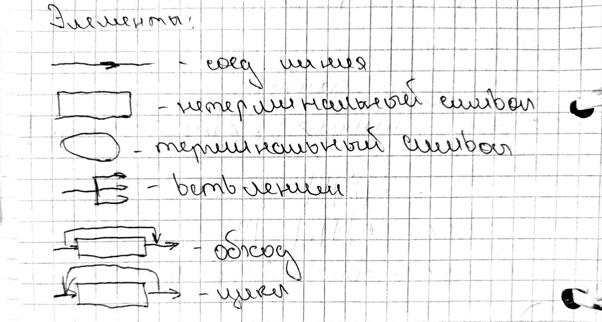
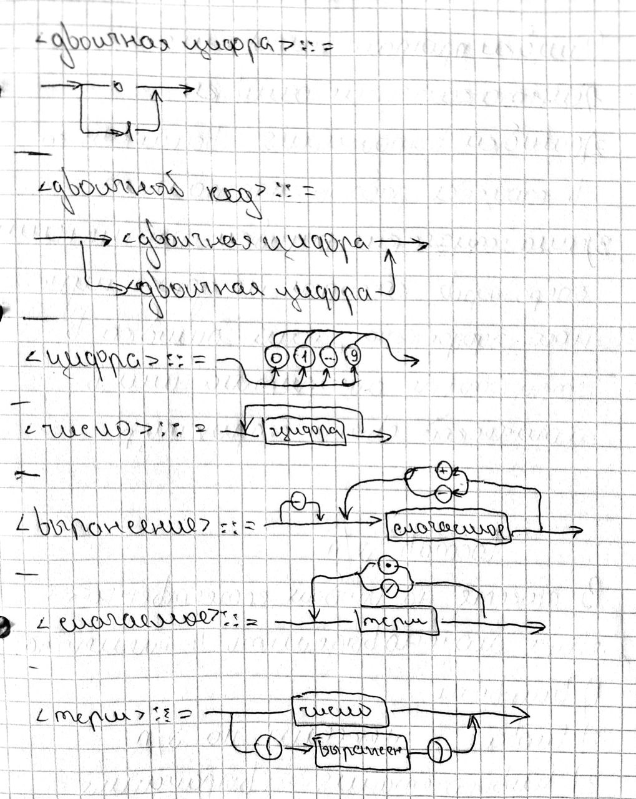
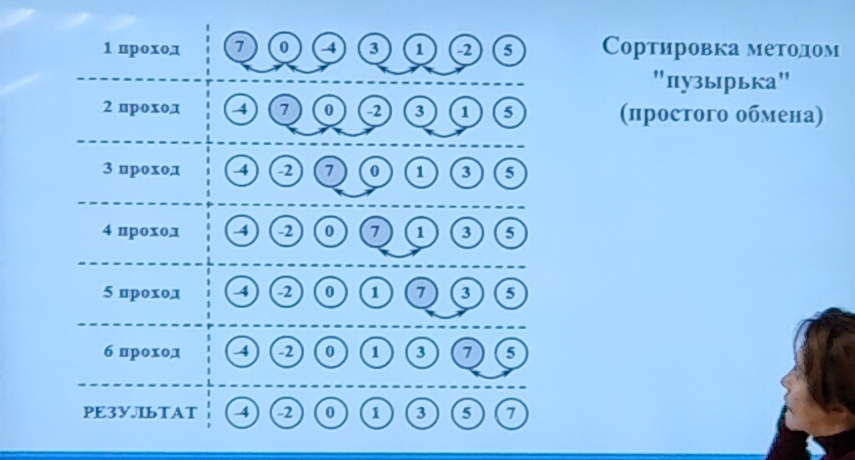
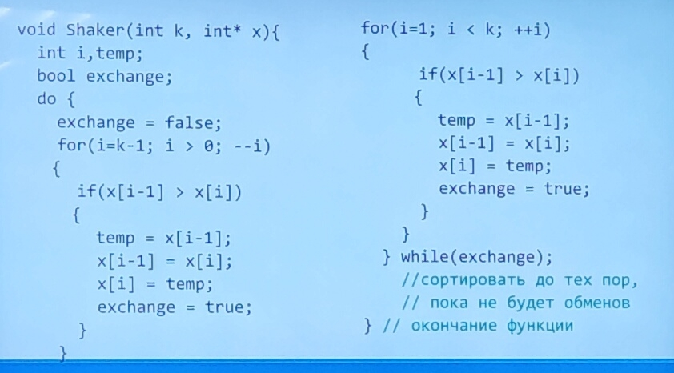
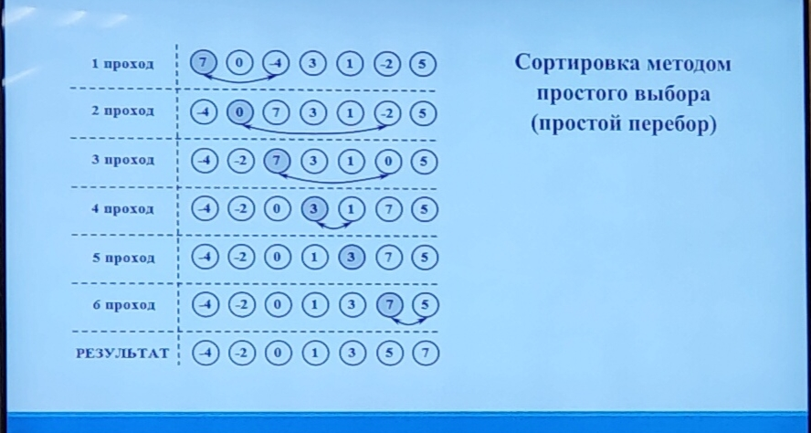
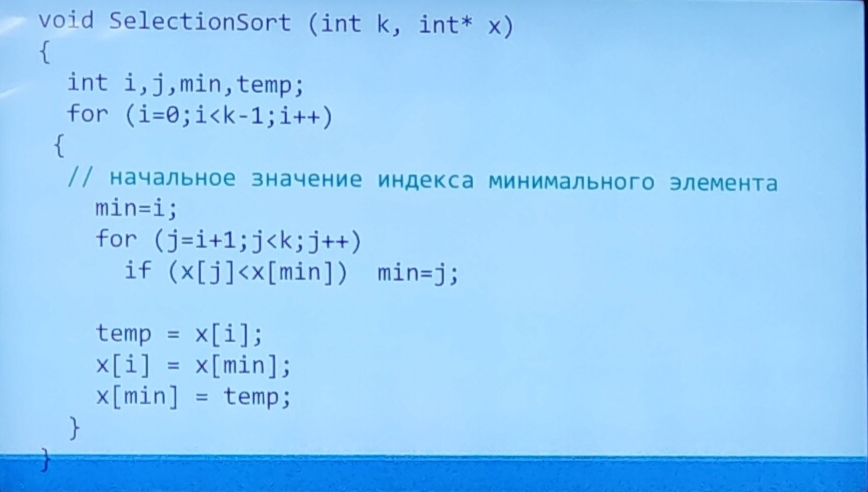
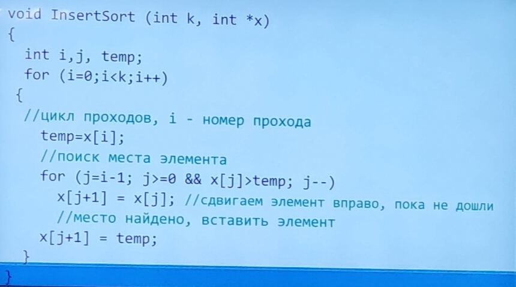
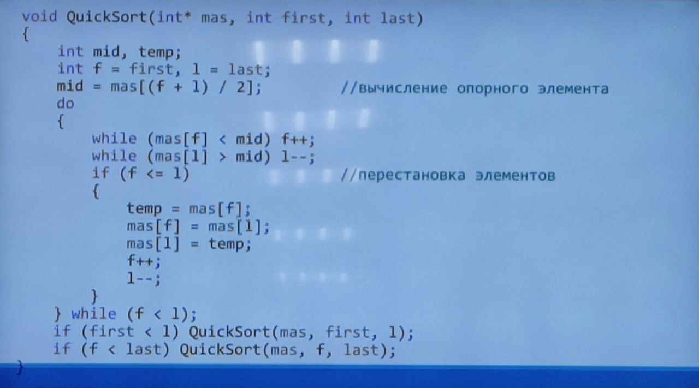

# Основы программирования
Тут не всё, но большенство. 

# Содержание

1. [ПоколенияЯП](# Синтаксис, семантика и прагматика.)

# Поколения ЯП
1. **Машинный код** - инструкции процессору и данные к ним
2. **Язык ассемблера** - команды, понятные человеку, и трансформируемые непосредственно в машинный код
3. **Языки высокого уровня** - команды не связаны непосредственно с аппаратной частью, при помощи некоторых инструментов преобразуются в форму, понятную аппаратному обеспечению (python, java, c#, c++)
4. **Языки ориентированные на специализированные области применения** (html, css, sql), повышают скорость создания и надежность
5. **Языки созданы для разработки ИИ** и решения проблем связанных с этой предметной областью
# Типы ЯП
* Структурный - программа представлена в виде структурированных блоков коротких подпрограмм.
* Процедурный - последовательно выполняемые операторы собираются в более крупные целостные структуры кода с помощью самого ЯП
* Логический - основан на автоматическом доказательстве теорем, а также на парадигме логического вывода
* Функциональный - процесс вычисления трактуется как вычисление значений функций в математическом понимании последней
* Объектно-ориентированный

# Принципы структурного программирования
* Отказ от оператора безусловного перехода (goto)
* Построение из 3-х базовых конструкций: последовательной, ветвящейся, циклической
* Конструкции могут быть вложены друг в друга
* Фрагменты программы можно представить в виде подпрограммы (функции)
* Каждую логический целостную конструкцию стоит оформить как блок
* У конструкции один вход/выход
* Разработка пошагово (сверху вниз)

# Понятие алгоритма, его свойства
**Алгоритм** - последовательность команд предназначенная исполнителю, в результате выполнения которой, он должен решить поставленную задачу

Свойства алгоритма:
* Дискретность - много малых частей
* Детерминированность - определение следующего шага исходя из текущего состояния
* Понятность - команды, которые исполнитель может выполнить
* Конечность - при конкретных входных данных должен заканчиваться и выдавать результат
* Универсальность - обработка различных входных данных
* Результативность

# Сущность трансляции. Компиляция / Интерпретация.
Язык на котором представлена входная программа — называется исходным языком, а сама программа исходным кодом.

Выходной язык — называется целевым языком или объектным кодом.

Цель трансляции — преобразовать текст с одного языка на другой, который понятен адресату текста.

Транслятор представляет собой программу, на основе которой компьютер преобразует вводимые в него программы в машинный язык.

Трансляторы бывают двух видов:

1) Компиляторы — читает всю программу целиком, делает её перевод и создаёт законченный вариант программы на машинном языке. Результат работы компилятора бинарный исполняемый файл.

2) Интерпретаторы — переводит и выполняет программу построчно.

После того, как программа откомпилирована ни исходный текст ни компилятор больше не нужны. В то же время программа обрабатываемая интерпретатором заново переводится на машинный язык при каждом запуске программы.

Откомпилированные программы работают быстрее, а интерпретируемые проще исправлять и  изменять.

# Синтаксис, семантика и прагматика.

Синтаксис — совокупность правил, определяющих допустимые конструкции языка. (Форма языка)

Семантика — совокупность правил, определяющих смысл синтаксически верных констркций языка. (Содержание языка)

Прагматика - методы, позволяющие исходя из постановки задачи составить программу ее решения

# Форма Бэкуса-Наура(БНФ)
Это формальная система описания синтаксиса, в котором одни синтаксические конструкции последовательно определяются через другие. БНФ используется для описания синтаксиса языков программирования, контекстно-свободных грамматик, а так же различных наборов инструкций и протоколов связи.

Терминал — Терминальный символ — Объект непосредственно присутствующий в словах языка и имеющий конкретное неизменное значение.
	
Не терминал — Не терминальный символ — Объект обозначающий какую либо сущность языка (например формула, арифм. Выражение, команда) и не имеющий конкретного символьного значения.

БНФ конструкция - определяет конечное число символов( Не терминалов ) и определяет правила замены символа на какую либо последовательность терминалов. Процесс построения можно представить поэтапно изначально имеется один символ, обычные символы представляются в виде некого названия заключённого в угловые скобки, затем этот символ заменяется некоторой последовательностью согласно одному из правил. Процесс повторяется и на каждом шаге один из символов заменяется последовательностью.
В конце получается цепочка состоящая из букв и не содержащая символы. Общий вид конструкции следующий: 

    <Опр. Символ> ::= <Option 1> | <Option 2>

    | - Или

    <Буква> ::= A|B|C|...|Z
    <Цифра> ::= 0|1|2|...|9
    <Идент> ::= <Буква> {<Буква>|<Цифра>}
    <Число> ::= <Цифра>|<Цифра><Число>

    <formula> ::= <num>|<formula><sign><num>
    <sign> ::= +|-
    - Сложение / Вычитание.


    <formula> ::= <op>|<formula><sign><num>
    <op> ::= <num>|(<formula>)
    <sign> ::= +|-

Прагматика — задаёт конкретизацию абстрактного вычислителя для данной вычислительной системы. Зачастую стандарт языка программирования не полностью задаёт поведение исполнителя оставляя некоторые вольности, которые производителями транслятора реализуются тем или иным образом.

# Синтаксические диаграммы




# Типы ошибок в программировании.

Существуют три типов ошибок:

1) Синтаксические ошибки — В любом ЯП каждое предложение ( оператор ) строится по определённым правилам. Если в программе находится предложение, которое нарушает это проавило, то говорят о наличии синтаксической ошибки. Синтаксические ошибки легко обнаруживаются и легко исправляются.

2) Ошибки в выполнении( Runtime error, исключительные ситуации ) - Возникают в процессе работы программы. Например программе передали некорректные значения или программа попыталась поделить на нуль. Ошибкии в выполнении легко обнаруживаются, однако устранения их может оказаться нетривиальной задачей

3) Семантические ошибки — применение операторов, которые не дают нужного эффекта или  ошибка в структуре алгоритма, или ошибка в логической взаимосвязей частей алгоритма, или применение алгоритма там, где он не подходит. Поиск и исправление семантических ошибок занимает основное время при написании и отладки программы.

# Состав языка программирования

В тексте на любом естественном языке можно выделить 4 основных элемента.
1) Символы
2) Слова
3) Словосочетания
4) Предложения

Подобные элементы содержит и любой язык программирования.
1) Слова называют лексемами.
2) Словосочетания выражениями.
3) Предложения операторами.

Алфавит языка — основные неделимые знаки с помощью которых пишутся все тексты на языке.

Лексемы(Элементарные конструкции) — минимальная единица языка имеющая самостоятельный смысл.

Выражение — задаёт правила вычисления некоторого значения.

Оператор — задает законченное описание некоторого действия.

Алфавит языка C++ содержит:
1) прописные и строчные латинские буквы и  знак подчёркивания.
2) Арабские цифры от 0-9
3) Спец. Знаки - « {}.|[]()=-/%
4) Пробелы, табуляции.

Лексемы включают в себе следующие понятия:
1) Идентификатор — имя программного объекта. В нём могут быть использованы латинские буквы, цифры и знак подчёркивания. Но начинаться он может лишь либо с буквы, либо с символа подчёркивания. Пробелы в идентификаторах не допускаются.
2) Ключевые (зарезервированные) слова. (Keywords) – слова, которые имеют специальные значения для компилятора. Их нельзя использовать в качетсве идентификаторов.
3)  Знаки операций — один или несколько символов действия над операндами. Операции могут быть унарные, бинарные или тернарная. В зависимости от количества операторов.
4) Константы — не изменяемые величины целого, вещественного, символьного или строкового типа
5) Разделители - (), ., ,,\<space\>.


## Комментарии
В c++ // - однострочный; /**/ - многострочный

## Типы данных

Типы данных — множества допустимых значений, которые может принимать тот или иной объект, а так же множества допустимых операций, которые приминимы к этому объекту

## Классификация типов данных в языке С++

В тетради. =\

## Типы данных

Базовые(Предопределены стандартом языка, указываются зарезервированными словами их не надо определять и нельзя разложить на более простые составляющие без потерь)

int, unsigned int, char, wchar_t, void, bool, float, double.

Существует четыре спецификатора уточняющих внутренние представление и диапазон стандартных типов.

signed, unsigned, long, short

- Производные(пользовательские) — Задаются пользователем и переменные этих типов создаются как с использованием базовых типов, так и с помощью других производных типов.

Vec, arrays, pointers, references

## Целочисленные тип данных

int signed 	      4(32)	 -2^31.. 2^31 – 1	int32_t

unsigned int 	      4(32) 	0, 2^32 – 1

short int 	      2 (16) 	-2^15..2^15 – 1

unsigned short int 2(16) 	0..2^16 – 1


long int	      4(32)	-2^31..2^31 – 1	 int32_t

long long int	      8(64)	-2^63..2^63-1		 int64_t


Для внутреннего знаковых целых чисел, характерно определение знака по старшему биту.

0 для положительных, 1 для отрицательных. Поэтому число нуль к положительным числам. И следовательно наблюдается асиметрия границ диапозонов. На практике рекомендуется использовать основной целый тип int – его данные практически всегда обрабатываются быстрее, чем данные других целых типов.

Короткий тип используется для хранения больших массивов чисел с целью экономии памяти при условии, что значения элементов не выходят за предельные границы этого типа.

Длинные типы необходимы в ситуации, когда не хватает типа int.


## Вещественный тип данных

Для представления вещественного типа данных используются два формата.
С фиксированной точкой
[sign][Целая часть].{Дробная часть}

Так же .168 = 0.168, 183 = 183.0

С плавающей точкой (Экспоненциальной форме)
мантисса E/e порядок

6.3E+03 = 6.3*10^+3
6.3e-03  = 6.3*10^-3

Мантисса — вещественное число в интервале от (-10..10)

float 		4(32)	 -3.4E+38..3.4E+38 → 1 бит на знак, 8 бит для экспоненты, 23 для мантиссы
double 	8(64) 	-1.7E+308..1.7E+308 → 1 бит на знак, 11 для экспоненты, 52 для мантиссы.
long double    8(64) 	-1.7E+308..1.7E+308

## Символьный тип данных
char – предназначена для хранения только одного символа. В памяти компьютера они хранятся как uint8_t. Соответствие меж символами и их кодами задаётся таблицей кодировки, которая может зависеть от компьютера и ОС. (ASCII)

wchar_t – предназначен для работы с набором символов для кодировки которых не достаточно одного байта. Например кодировки unicode. Размер wchar_t – 2 байта \ 16 бит

## Логический тип данных.
В языке С++ используется двоичная логика. Для обозначения лжи используется нулевое значение, для обозначения правды ненулевое значение. 1 байт. 

## Тип void
Множество значения этого типа пусто. Тип void имеет три назначения.
1) Указание о невозвращении функцией значения.
2) Указание о неполучении функцией аргументов.
3) Создание нетипизированных указателей.

# Преобразование типов

Преобразование типов — это приведение значение одного типа в другой тип.  В общем виде операция приведения типа выглядит следующим образом.
* int(X)
* float(2/5)
* long(x+y/0.5)

Выделяют явное и неявное приведение типов.
При явном приведении указывается тип, к которому необходимо преобразовать исходную переменную.

При неявном преобразование происходит автоматически по правилам заложенным в языке программирования C++.

Неявное преобразование типов используется при выполнении математических операций для того, чтобы привести операнды выражения к общему типу или расширить короткие величины до целых или же целые до длинных.

# Спецификатор auto

Иногда бывает трудно определить тип выражения и согласно стандарту языка можно предоставить компилятору самому определять тип. Для этого и используется спецификатор auto. При этом если мы определяем переменную со спецификатором auto, то эта переменная обязательно должна быть инициализирована каким-либо значением. На основании присвоенного значения компилятор определяет тип переменной.

    auto number = 5;
    auto number; - Не работает!

# Структура программы

Программа на языке C++ состоит из функций, описаний и директив препроцессора. 

Одна из функций обязательно носить имя main – это entry point.

# Переменные

Переменные в C++ - это именованная область памяти в которой хранятся данные определённого типа. У переменной есть имя и значение имя служит для обращения к области памяти в которой хранится значение. Перед использованием любая переменная должна быть описана. 

Общий вид описания переменной:

[класс памяти] Optional[const] type name [initializator];

Классы памяти:
* auto
* extern
* static
* register

Класс памяти определяет время жизни и область видимости переменной. 
Если класс памяти не указан явно, то компилятор определит его исходя из контекста объявления.

Время жизни может быть:
* Постоянным (`static)
* Временным (В течении выполнения некоторого блока)

Область видимости — часть текста программы из которой допустим обычный доступ к переменной. Обычно область видимости совпадает с областью действия, кроме случая, когда во внутреннем блоке существует переменная с таким же именем.

Рассмотрим классы памяти подробнее.

auto – автоматическая локальная переменная. Спецификатор auto может быть задан только при определении объектов блоков, например в теле функции. Этим переменным память выделяется при входе в блок и освобождается при выходе из блока. Вне блока такие переменные не существуют.

extern – Глобальная переменная, находящаяся в другом месте программы(В другом файле или далее по тексту). Используется для создания переменных доступных во всех файлах программы.

static – Статическая переменная, существующая только в приделах одного файла.

register – аналогична auto, но память под такие переменные выделяется в регистрах процессора. Если такой возможности нет, то переменная обрабатывается как переменная с классом памяти auto.

const – показывает, что переменную нельзя изменять.

Инициализатор позволяет задать начальное значение пременной. Int a [= 0]

В примере переменная a объявлена вне блока. ::a = 3 – обращение к этой переменной.

Описание переменной как объявление или как определение. Объявление содержит о классе памяти и типе переменной. Определение вместе с этой информацией даёт указание выделить память. 
extern int x – объявление.

# Операции в C++
*  Виды операций.
*  Арифметика (+, -, *, /,  %)
*  Инкрементика/Декрементика (++a, a++)
*  Присваивания/Модификация (=, +=, -=)
*  Сравнение (==, !=, >, <, <=, >=)
*  Логические (&&, ||, ==, !=)
*  Преобразование типа
*  Ввода-вывода
*  Побитовые логические(&, |, <<, >>, ^)
*  Сдвига ( >>, << ) 
*  Индексации(arr[1])
*  Адресации, разадресации(&a, *a)
*  Тернарная операция Условие ? Expr 1 : Expr 2 – Они могут быть вложены
*  (1==1) ? (2==2) ? true : false : (3 == 3) ? true : false;

M << L == M * 2^L; M >> L == M / 2^L

# какой то обрывок 
Доказано, что можно создать любую программу из 3-ёх структур

Линейной структуры — [Последовательное соединение двух или более операторов]
Ветвлённой структуры — [Задаёт выполнение одного из двух операторов в зависимости от условий]
Цикловой структуры — [Неоднократное повторение одного и тоже]

# Оператор выражения

Любое выражение, завершающееся с ; рассматривается как оператор, выполнение которого заключается в вычислении выражения. В частном случае выражение является пустым оператором. Он используется, когда по синтаксису оператор требуется, а по смыслу нет.

Примеры:
1. i++;
2. a* = b + c;
3. f(d, k);

# Составные операторы.
К составным операторам относятся непосредственно составные операторы и блоки. В обоих случаях — это последовательность операторов заключённая в фигурные скобки. Блок отличается от составного опреатора наличием определения в теле блока.

```cpp
{
	// Составной оператор
	n++;
	summa += n;
}

{
	//Это блок
	int n = 0;
	n++;
	summa += n;
}
```

# Условный оператор.
Синтаксис условного оператора:
if(expression) operator_1;
[else operator_2;]

Сначала вычисляется выражение, которое может иметь арифметический тип или тип указателя. Если оно не равно нулю, то выполняется первый оператор, иначе второй. После этого управление передаётся следующему за условному оператору.

If (a<0) b = 1;

# Оператор выбора
Оператор выбора определяет множественный выбор. 
Синтаксис оператора следующий:
```cpp
switch(expr){
	…,
	case const1: 
    op1; 
    break;
	case const2: 
    op2; 
    break;
	default: 
    op;
    break;
}
```

Сначала вычисляется expr – оно должно быть целочисленным. Полученые значения последовательно сравниваются с константами записынными после case, при первом совпадении выполняются операторы, помеченные данной меткой. Если выполненные операторы не содержат операторы перехода, то далее выполняются операторы всех следующий вариантов, пока не появятся оператор перехода или не закончится переключатель. Если значение выражение не совпало ни с одной константой, то выполняются операторы, которые следуют за меткой default:. Метка default: может отсутствовать.
На оператор выбора накладываются следующие ограничения:
1. Несколько разнотипных условий проверить нельзя.
2. Условие связанное с вещественными выражениями проверить нельзя.
3. Сравнивать значения выражения с другими переменными или выражениями нельзя.

# Операторы цикла.
Различают итерационный и арифметические циклы.

Группа действий, повторяющихся в цикле называется его телом. Однократное выполнение цикла называется его шагом. В итерационных циклах известно условие выполнения цикла для арифметического типа известно количество раз выполнения тела цикла.
1. Цикл с предусловием — синтаксис и семантика его следующая while(condition) op; В качестве условия чаще всего используется отношения или логическая операция. Тело цикла выполняется до тех пор, пока условие не равен нулю.
2. Оператор цикла с пост-условием do op; while(cond); т. к. первая проверка условия осуществляется после выполнения тела цикла, то операторы в теле цикла выполнится один раз в любом случае
3. Оператор цикла с параметром. Синтаксис оператора следующий for(expr1; expr2; expr3) {op_1; op_2; op_3} | for(начало; условие продолжения; шаг) op; expr1, expr3 могут состоять из нескольких выражений, разделённых запятыми. Expr1 задает начальные значения для цикла. Expr2 определяет условие выполнение цикла(как в while, если != 0, то выполняется). Expr3 задаёт изменения параметра цикла или других переменных. Любое из выражений может отсутствовать, но разделяющие их точки с запятой должны быть обязательно.

# Операторы перехода.
Операторы перехода — осуществляют безусловную передачу управления.

1) Оператор break – оператор прерывания цикла.
2) Оператор continue – осуществляет переход к след. Итерации цикла.
3. goto – имеет форму goto marker; перейти на линию marker. 
Использовать не рекомендуется. (Принципы структурного программирования).

4. оператор return – оператор возврата из функции. Он завершает выполнение функции и передаёт управления в точку её вызова.
Выгляди так: return [expr];

Примеры.
```cpp
/ Найти положительные числа
for(int k = 0, s = 0, x=1; x!= 0;) {
	cin >> x;
	if (x <= 0)
		continue;
	k++;
	s += x;
}

cout << s << “ “ << k << endl;

// Простота числа. Верн число
for (int i = 2; i < n; i++)
	if (n % i == 0)
		break;

// v2
bool isPrime = True;

for (int i = 2; i < n / 2; i++) {
	if (n % i == 0) {
		isPrime = False;	
		break;
	}
}

if (n > 1) …


// Сумма цифер.
int a, s;
for(s = 0; a; a /= 10)
	s += a % 10;
```

# Одномерный массив.

В языке C++ кроме базовых типов разрешено вводить и использовать производные типы полученные на основе базовых. 

Массив — это упорядоченная последовательность переменных одного типа расположенная в смежных ячейках памяти. 

Каждому элементу отводится одна или несколько ячеек памяти. 
Все элементы имеют одно имя и отличаются индексами.
Количество элементов массива называется его размером.

Чтобы выделить в памяти нужное количество ячеек для размещения массива необходимо заранее знать его размер.

Резервирование памяти для массива происходит на этапе компиляции.

Определение массива задаётся следующим образом:
type name[size];
int a[100];

Элементы массива можно задавать при его определении.
type name[optional<length>] = {1, 2, 3, … ,  n};

## Обработка одномерных массивов.
При работе с массивами часто требуется одинаково обрабатывать все элементы или часть элементов массивов. Для этого организуется перебор элементов массива, который характеризуется:

1) Направление перебора.
2) Количество одновременно обрабатываемых элементов.
3) Характером изменения индексов.

По направлении перебора массив обрабатывается 
1) от начала к концу.
2) от конца к началу.
3) с обоих концов к середине.

Индексы могут менятся:
1) Линейно(с постоянным шагом)
2) Не линейно(с переменным шагом)

примеры: 
1)
```cpp
for(int i=0; I<n; i++)
	обработка a[i];
```
2)
```cpp
for(int I=0; I < n; I += step)
	handle(a[i]);
```
3)
```cpp
for(int I = n – 1; i>= 0; i—)
	handle(a[i]);
```
4)
```cpp
for(int I = n – 1; I >= 0; I -=step)
	handle(a[i]);
```
## Псевдо-динамические массивы и заполнение массивов с клавиатуры.
```cpp
const int MAX_SIZE=100;
int buf[MAX_SIZE];

int n;
cin >> n;

for(int I = 0; I < n; i++)
	cin >>buf[i];
```
## Формирование массива с помощью датчика случайных чисел.
```cpp
Int a[100];
int n;
cin >> n;
for(int I = 0; I < n; i++) {
	a[i] = rand()%100-50;
	cout << a[i] << “ “;
} 
```
функция rand() возвращает псевдо случайное число из диапозона от 0 до 2^14 – 1.

Для того, чтобы масштабировать интервал генерации чисел нужно воспользоваться операции взятия остатка от деления.

## Найти сумму элементов расположенных на чётных позициях.


Int sum = 0;

for(int i=0; I<n; i+=2)
	sum += a[i];

Обработка двух элементов массива.
```cpp
Обрабатывает по два элемента двигаясь с концов
for(int i=0, j=n-1; i<n; i++, j—)
	handle(a[i], a[j]);
```

Обрабатывает два соседних. (a[0] && a[1]. a[1] && a[2].)
```cpp
for(int I = 0; I < (n - 1); I++)
	handle(a[i], a[i+1]);
```

Обработка двух соседних элементов кол-во итераций / 2(a[0] && a[1]. a[2] && a[3]. a[4] && a[5]);
```cpp
for(int I = 0; I < n/2 ; I += 2)
	handle(a[i], a[i+1]);
```

# Классы задач по обработке массивов.

К задачам первого класса относятся задачи, в которых выполняется однотипная обработка всех или указанных элементов массива.

```cpp
Int sum = 0;
for(int I = 0; I < n; I++)
	sum += a[i];
```

К задачам второго класса относятся задачи, в которых изменяется порядок следования элементов массива.

К задачам третьего класса относятся задачи, в которых выполняется обработка нескольких массивов или под-массивов одного массива

Массивы могут обрабатываться по одной схеме(синхронная обработка) или по разным схемам(асинхронная обработка массива)

К задачам четвёртого класса относятся задачи, в которых требуется найти первый элемент массива обладающий некоторым искомым свойством. - Поисковые задачи.

# Решение Задачи Второго класса
Реверсит
```cpp
for(int I = 0, j = n – 1; I<J; i++ j—) {
	int temp = a[i];
	a[i]=a[j];
	a[j] = temp;
}
```

Попарно меняет местами
```cpp
for(int I = 0; I<n-1; i+=2) {
	int temp = a[i];
	a[i]=a[i+1];
	a[i+1] = temp;
}
```
Задачи Третьего Класса.
```cpp
for(int I = 0; I < n; i++)
	c[i]=a[i]+b[i];

for(int I = 0; I < n; I++)
	cout << c[i] << “ “;
```

Задачи четвёртого класса.
```cpp
Int k, I, nom, ok=0;
cin >> k;
for(int i=0; I < n; i++) {
	if(a[i]==k) {
		ok=1;
		nom=i;
		break;
	}
}

if(ok==1)
	cout << Порядковый номер « nom;
else
	cout << Такого элемента нет!


Int min=1 // % 5 != 0
for(int I = 0; I < n; i++) 
	if(a[i]%5==0 && (min == 1 || min > a[i])))
		min = a[i];
if (min != 1)
	min;
else
	no;
```

# Двумерных массив (Матрици)

Многомерные массивы задаются указанием Каждого измерения в квадратных скобках.
В общем виде описание двумерного массива выглядит так:
```cpp
int matr = [6][8];

int matr2[][2] = {
	{2, 6},
	{5, 1},
	{9, 9}
};

int marr3 [3][2] = {1, 1, 0, 2, 1, 0};
```

в памяти двумерный массив располагается в смежных ячейках памяти построчно.

При инициализации двумерного массива он представляется либо как массив массивов, при этом каждый массив заключается в фигурные скобки, либо, задаётся общий список элементов в том порядке, в котором, элементы будут располагаться в памяти.

В первом случае левую размерность можно не указывать.

# Диагонали двумерных массивов.
ДИАГОНАЛИ СУЩЕСТВУЮТ ТОЛЬКО В КВАДРАТНЫХ МАТРИЦАХ.
Если 
````
I == J => На главной диагонали
I > J => Ниже главной диагонали
I < J => Выше главной диагонали.

Побочные диагонали(Это  глав. диагональ в другую сторону)
I == n – j – 1 => На побочной диагонали
I > n – j – 1 => Ниже побочной диагонали
I < n – j – 1 => Выше побочной диагонали.
````
```cpp
// Сумма диагонали
for(int I = 0; I < n; I++)
	s += a[i][i];
```

# Базовые алгоритмы обработки матриц.
Базовыми алгоритмами обработки матриц являются алгоритмы, которые используются при обработке двумерных массивов. Однако реализацию этих алгоритмов можно  условно рассматривать для двух типов задач. 

Задачи первого типа реализуются при просмотре всех элементов матрицы. начальное задание параметров выполняется перед двойным циклом. В этом случае запись операторов цикла осуществляется последовательно, друг-за-другом и имеет вид
```cpp
//<Начальная установка искомых параметров>
for(int I = 0; I < n; I++)
	for(int j = 0; j < n; j++)
		<Тело цикла>;
```

# Указатели 

Если интересно доп инфа (https://youtu.be/EKifZWIdNgM)

Указатели на объект содержит адрес области памяти в которой хранятся данные определённого типа.
Простейшее объявление указателя на объект имеет вид: 
```cpp
type *name;
```
Где тип может быть любым кроме ссылки или видового поля. Причём тип может быть к этому моменту только объявлен, но не определён. Звёздочка относится непосредственно к имени, поэтому, для того, чтобы определить несколько указателей требуется ставить её перед именем  каждого объекта.

Пример:
```cpp
int *i;
int *a, b, *c;
void *h;
double *f, *ff;
```
Существует возможность определить указатель на указатель.
```cpp
int** a;
```
Указатель на функцию содержит адрес в сегменте кода по которому располагается исполняемый код функции, то есть адрес по которому передаётся управление при вызове функции. Указатель на функцию используется для косвенного вызова функции(т.е. Не через её имя, а через обращение к переменной, хранящей её адрес).

Пример:
```cpp
type (*name) (args);
int (*fun)(double, double);
```
Указатель на void в тех случаях, когда конкретный тип объекта адрес которого требуется хранить не определён(например, если в одной и той же переменной в разные моменты времени требуется хранить адреса объекта различных типов).

Указателю на void можно присвоить значение указателя любого типа, а также, сравнивать с любыми указателями, но перед выполнением какого-либо действия с областью памяти на которую он ссылается требуется преобразовать его к конкретному типу явным образом.

Указатель может быть константой или переменной, а также указывать на константу или переменную.

Примеры:
```cpp
int I;
const int ci=1;
int *pi;
const int *pci;

int *pi = &i;
const int *pci = &ci;

int *const cpi =&i;
const int *const cpi =&i;
```

# Инициализация указателей

При определении указателя надо стремится выполнить его инициализацию, так как, непреднамеренное использование не инициализированных указателей одна из самых распространённых ошибок.

Инициализатор описывается после имени указателя, либо в круглых скобках, либо после знака равенства.

Существую следующие способы инициализации указателя:
```cpp
// 1)
int a = 5;
int *p = &a;
// OR
int *p(&a);

// 2)
int *n = NULL;

// 3)
char *cp=(char*) 0x B800 0000; // В явном виде.
```

# Динамические перменные.
Все переменные объявленные в программе размещаются одной непрерывной областью памяти, которую называют сегментом данных. Обычно она занимает 64 килобайта. Такие переменные не меняют своего размера в ходе выполнения программы и называются статическими. Однако размера сегментов данных может быть не достаточно для размещения больших объёмов информации выходом из этой ситуации является использование динамической памяти.

Динамическая память — это память выделяемая программе для её работы за вычетом сегмента данных и стека, в котором хранятся локальные переменные подпрограмм и собственные тела подпрограммы. Для работы с динамической памяти используют указатели. С их помощью осуществляется доступ к участкам динамической памяти, которые называются динамическими переменными.

Динамические переменные создаются с помощью специальных операций и существуют они, либо до конца программы, либо до тех пор пока не будут уничтожены специальными операциями.

Для создания динамической переменной используется операция **new**, которая позваляет и сделать доступную участок динамической памяти, который соответствуют заданному типу данных. Если задан инициализатор, то ….

Общий вид операций new след.
```cpp
Ptr = new type[initializator];
int *x= new int(5);
delete x; // Удаление
```
Для удаления динамической переменной используется delete.
```cpp
delete Ptr;
```
Где указатель содержит адрес участка памяти ранее выделенный с помощью операции new.  

# Операции с указателями
1) Разыменование *
2) Присваивание
3) арифм. Операции
4) Сравнение
5) Приведение типов

```cpp
char *pc;
int *pi;
float *pf;
….
pc++ // Увеличилось на 1
pi++; // Увеличилось на 4
pf++; // Увеличилось на 4;
```

Разность  двух указателей( Разность их значения / sizeof(type))

Обычно разность применяется для указателей, ссылающихся на элементы одного и того же массива для того чтобы определить на каком растоянии друг от друга находятся элементы.

Суммирования двух указателей не допускается. Но можно суммировать указатель и константу. При записи выражений с указателями обязательно обращать внимание на приоритет операций.  

# Приведение типов.

На одну и ту же область памяти могут ссылаться указатели разного типа, если применить к ним операции разыменования, то получатся разные результаты.

Пример
```cpp
int a = 123;
int *pi = &a;
char *pc = (char*)&a;
float *pf = (float*)&a;
cout<<pi<<” ”<<*pi<<endl;
cout<<pc<<” ”<<*pc<<endl;
cout<<pi<<” ”<<*pi<<endl;
```
У трёх указателей, адрес один и тот же, но при разыменовании получатся разные значения.
```cpp
Void *ptr;
int I;
int *ptri;
ptr = &i;
ptr = ptr1;
ptri=ptr; // Недопустимо
ptri = (int *)ptr;
```

# Операторы используемые с указателями.(*, &)

Оператор & - Унарный, он возвращает адрес в памяти по которому находится его операнд.

Например:
```cpp
int a = 5;
int *aptr;
aptr = &a;

int value = *aptr;
```
В переменную aptr помещается адрес переменной a. Этот адрес соответствует области во внутренней памяти компьютера, которая принадлежит переменной a. Выполнение этой инструкции никак не влияет на значение переменной a.

Оператор * - Унарный, он обращается к значению переменной, расположенной по адресу заданному его операндом.

Переменные указатели всегда должны указывать на соответствующий тип данных. Например при объявлении указателя типа int компилятор предполагает, что все значения на которые он ссылается имеют этот тип и не позволит выполнить операции, если типы указателей несовместимы.

Example
```cpp
int *p;
double x,y;
x = 123.23;
p = (int *) &x;

y = *p;
cout << p;
```

# Ссылки

Ссылка позволяет определить альтернативное имя переменной. Она не создаёт копию объекта, а является другим именем. Формат объявления ссылки следующий

[type]& name_of_link = name_of_object;
```cpp
int x;
int& sx = x;
const char& CR = “\n”;
```
Правила работы со ссылками:
1) Переменная ссылка должна быть явно инициализирована при её описании, если она не      является параметром функции.
2) Не описана как extern и не ссылается на поле класса.
3) После инициализации ссылке не может быть присвоено другое значение.
4) Не существует указателей на ссылки, массивов ссылок, и ссылок на ссылок.
5) Операция над ссылкой приводит к изменению величины на которую она ссылается.
6) Ссылка не занимает дополнительного пространства в памяти.

Примеры:
```cpp
int I = 123; // = 123
int& si = I; // = 123

I = 456;
// I = 456; si = 456;

I = 0;
// I = 0; si = 0;
```

Отличия ссылок от указателей:
1) Указатель может быть повторно назначен любое количество раз. В то время, как ссылка не может быть переназначена после привязки.
2) Указатели могут ссылаться в никуда(В Null), тогда как ссылка всегда ссылается на объект.
3) Невозможно получить адрес ссылки.
4) Не существует арифметики ссылок, но возможно взять адрес объекта, на который ссылается ссылка и выполнить арифметику указателя для него.

Основные правила использования ссылок и указателей:
* Ссылки используются в параметрах функций и возвращаемых типов. Для того, чтобы определить удобный и само-документированный интерфейс программы.
* Указатели используются для реализации различных структур данных.

# Динамические массивы.

Доступ к произвольному элементу массива обеспечивается по имени массива и индексу(То есть целочисленному смещению от начала)
Имя массива является указателем-константой. К нему применимы все правила адресной арифметики связанные с указателями.

Имя массива [index]

name_arr = &name_arr == &name_arr[]

Доступ к элементам массива возможен по его имени как к указателю.
Int z[3];
z[0] == *(z) == *(z+0)
z[1] == *(z+1)


Рассмотрим пример в котором выведем элементы массива, используя имя массива, как указатель.
```cpp
for(int I = 0; I < size; I++)
	cout << endl << *(x + I);
```
В общем виде, обращение к элементу массива относят к постфиксному выражению вида:

PE[IE]
При использовании адресной арифметики получим

*(PE + IE)

И поскольку сложение комутативно, то справедливы равенства
*(x + I)  == *(I + x)

Если до начала работы программы неизвестно сколько элементов в массиве, то следует использовать динамические массивы. Память под них выделяется с помощью операции new в  динамической памяти во время выполнения программы. Адресс начала массива хранится в переменной, являющаяся указателем. Если динамический массив в какой то момент времени перестаёт быть нужным и мы собираемся повторно использовать память, то её необходимо освободить с помощью операции delete.

```cpp
int n;
cin >> n;
int *arr = new int[n];
delete[] arr;
```
Квадратные скобки операции delete при освобождении  памяти из под массива обязательно. их отсутствие может привести к UB(undefined behaviour). 

Область действия и время жизни указателей подчиняются общим правилам. Переменная при выходе из блока «Теряется», и если эта переменная — указатель, то память перестаёт быть доступной, однако не помечается как свободная и не может быть использована в дальнейшем. Это называется утечкой памяти(memory leaking) и является распространённой ошибкой.

Пример: нету

Для выделения памяти для двумерного массива существуют 3 способа:
1. С помощью одномерного массива.
2. С помощью массива указателей.
3. С использованием дополнительного массива.

Реализация двумерного массива посредствам одномерного является естевственной в силу того, что в памяти компьютера элементы хранятся последовательно. Недостатком этого способа является то, что недоступен автоматический перевод двумерного индекса в одномерный. В общем случае матрица содержит n строк и m столбцов. Индекс любого элемента матрицы можно получить по формуле: index = I * m + j;

Обращение a[i][j] – некорректно, правильное обращение к элементу использования указателя:
*(p+i*m+j)

Для реализации двумерного массива с помощью массива указателей необходимо:
1) Выделить блок памяти под массив указателей.
2) Выделить блоки памяти под одномерные массивы, представляющие собой строки матрицы.
3) Записать адресат строк в массив указателей.

Реализация двумерного динамического массива с помощью вспомогательного массива описывает так называемые свободные массивы.

Свободный массив — это массив размер каждой строки которого может быть различным.
Преимущества использования свободного массива заключается в том, что не требуется выделять память для хранения строки максимально возможной длинны.

```cpp
int n;
cin >> n;
int **a = new int *[n];
int *m = new int[n];

for (size_t i = 0; i < n; i++>) {
	cout << " Размер " << i << " строки: ";
	cin >> m[i];
	a[i] = new int[m[i]];
	for(size_t j = 0; j < m[i]; j++) {
		cin >> a[i][j]
	}
}

for(size_t i = 0; i < n; i++) {
	for(size_t j = 0; j < m[i]; j++) {
		cout << a[i][j] << '\t';
	}
	cout << '\n';
}

for (size_t i = 0; i < n; i++>) {
	delete[] a[i]
}
delete[] a;
delete[] m;
```
# Функции
Для уменьшения сложности программы, её разбивают на части.
В C++ можно разбивать на подзадачи, каждая из которых может быть решена с помощью отдельной функции. Разбиение задачи на функции также позволяет уменьшить избыточность кода, т. к. функция записывается один раз, а вызываться может многократно. Часто используемые функции можно засунуть в библиотеки.

## Объявление и определение функции.
Функция это — именованная последовательность описаний и операторов исполняющее законченое действие. Любая функция должна быть объявлена и определена. Прототип функции задаёт: Имя функции, тип возвращаемого значения, и список передаваемых параметров. Определение содержит кроме объявления: Тело функции, которое предстваляет собой последовательность описаний и определений. 

Общий вид функций:
```
type name_of_func([arg_v])
{body_of_func}
```
В теле функции обязательно должен быть оператор, который возвращает полученное значение в точку вызова. Оно может иметь две формы:
1) return выражения
2) return; - пустой return

Первая форма используется для возврата результата, поэтому тип выраженния должен совпадать с типом функции. Вторая форма используется, если функция не возвращает значения, т. е. имеет тип void. Если функция возвращает void, то программист имеет право не использовать этот оператор в теле функции. В этом случае компилятор автоматически добавит в него конец функции перед закрывающейся фигурной скобкой. Тип возвращаемого значения может быть любым кроме массива и функции, но может быть указателем на массив и указателем на функции.

Список формальных параметров — это список величин, которые требуется передать в функцию элементы списка разделяются запятыми, для каждого параметра указывается его имя и тип.

В объявлениях функции имена параметров можно не указывать. Для того, чтобы функция выполнилась её необходимо вызвать. При вызове указывается имя функции и список фактических параметров. Фактические параметры — заменяют формальные параметры при выполнении операторов тела функции. Фактические и формальные параметры должны совпадать по количеству и типу. Объявление функции должно находится в тексте раньше вызова функции чтобы компилятор мог осуществить проверку правильности вызова.

## Прототип функции
Для того, чтобы к функции можно было обратится в том же файле должно находится объявление функции(прототип). Для функций описаных выше прототипами являются 

```cpp
    double line(double, double, double, double);
    double square(double, double, double);
    bool triangle(double, double, double);
```

При наличии прототипов вызываемые функции не обязаны размещаться в одном файле с вызывающей функцией, а могут быть оформлены в виде отдельных модулей и хранится в откомпилированном виде в библиотеке объектных модулей. Это относится и к функциям из стандартных модулей. В этом случае определение библиотечных функций уже оттранслированы и оформлены в виде объектных модулей, хранятся в библиотеке компилятора, а описание функций необходимо включать в программу дополнительно. Это делается с помощью комманды ```#inklyude```.

## Локальные и глобальные переменные

Переменные, которые используются внутри функции называются локальными. Память под них выделяется в стеке. Поэтому после окончания работы функции они удаляются из памяти.</br>
Нельзя возвращать указатель на локальную переменную, т.к. память, выделенная этой переменной будет освобождаться.

```cpp
int *f() {
    int a;
    ...
    return &a; // БЛЯЯЯТЬ
}
```

<mark>Глобальные переменные</mark> - это переменные, которые описаны вне функций, они видны во всех функциях, где нет локальных переменных с такими-же временами. 

```cpp
int a,b;
void Change() {
    int r, a = 5;
    r = a;
    a = b;
    b = r;
    cout << a << b; 
}

int main() {
    cin >> a >> b;
    Change();
    cout <<a<<b;
    return 0;
}
```

Глобальные переменные можно использовать для передачи данных между функциями, но делать этого не рекомендуется, так как это затрудняет отладку программы и премядствует помещению функций в библиотеки. Нужно стремится к тому, чтобы функции были максимально независимы, а их интерфейс полностью определялся прототипом функции.

## Параметры функции
Существует два способа передачи параметров в функцию. По значению и по адрессу, при передачи параметров по значению выполняются следующие действия.

1. Вычисляются значения выражений стоящие на месте формальных параметров.
2. В стеке выделяется память от формальных параметров функции.
3. Каждому фактическому параметру присваивается значение формального параметра. При это проверяется соответствие типов и при необходимости и возможности выполняется преобразование.

```cpp
void Change(int a, int b) { //Передача по значению
    int r = a;
    a = b;
    b = r;
}
...
int x = 1, y = 5;
Change(x,y);
cout << x << y;
```

При передаче по адрессу в стек заносятся копии адрессов параметров, и следовательно, у функции появляется доступ к ячейке памяти с которой находится фактический параметр и она может его изменить.

Для передачи по адрессу также могут использоваться ссылки. при передаче по ссылке в функцию передаётся адресс указанного при вызове параметра, а внутри функции все обращения к параметру неявно разыменовываются.

```cpp
void Change(int &a, int &b) {
    int r = a;
    a = b;
    b = r;
} 
...
int x = 1, y = 5;
Change(x, y);
cout << x << y;
```

Использование ссылок вместо указателей улучшает читаемость программы, так как не надо применять операцию разыменовывания, кроме того, использование ссылок более эффективно, так как не требует копирования параметов, если требуется запретить изменения параметра внутри функции используется модификатор <mark>**const**</mark>.

### Передача массивов как параметров функции.
при использовании массива как параметров в функцию передаётся указатель на первый элемент. т. е. массив всегда передаётся по адрессу, при этом теряется информация о количестве элементов массива, поэтому размерность массива следует передавать как отдельный параметр.

```cpp
int form(int x[100]) {
    int m;
    cin >> m;
    for(int i = 0; i < m; i++)
        x[i] = rand()%100;
    return x;
}

void print(int x[100], int m) {
    for(int i = 0; i < m; i++)
        printf("%d ", x[i]);
}


int main() {
    int a[100];
    int n;
    n = form(a);
    print(a, n);
    return 0;
}
```

## Функции с начальными(умалчиваемыми) значениями(параметрами).

В C++ существует возможность задать параметру некоторое значение, которое будет автоматически использовано, если при вызове функций, не задаётся аргумент, соответствующий этому параметру.

Аргументы передаваемые по умолчанию можно использовать, чтобы упростить обращение к сложным функциям, а также в качестве сокращённой формы перегрузки функции.

Задание параметров по умолчанию синтаксически аналогично инициализации переменных.

```cpp
void func(double num = 0.0, char ch = 'X') {
    ...
}

myfunc(192,13, 'A');
myfunc(10.1);
myfunc();
```

Все параметры, которые принимают значения по умолчанию должны быть расположены справа от остальных.

```cpp
//Неверно
void f(int a = 1, int b);
int myfunc(float f, char *str, int i = 10, int j);
```

## Подставляемые(inline) функции.

Некоторые функции в C++ можно определить с помощью служебного слова ```inline``` такая функция называется <mark>подставляемой</mark> или <mark>встраимовой</mark>.

```cpp
inline float Line(float x1, float y1, float x2=0, float y2=0) {
    return sqrt(pow(x1-x2, 2)+pow(y1-y2, 2));
}


int main() {
    float D = Line (a1, b1, a2, b2);
}
```

Обрабатывая каждый вызов подставляемой функции, компилятор пытается подставить в текст программы код операторов её тела.

Спецификатор ```inline``` определяет для функции так называемое "Внутренее связывание", которое заключается в том, что, вместо вызова функции подставляются комманды её кода. При этом может увеличиваться размер программы, но исключаются затраты на передачу управления вызываемой функции и возврата из неё.

Подставляемые функции используют, если тело функции состоит из нескольких операторов. Подставляемые !неуслышал! не могут быть.

1. Рекурсивные функции.
2. Функция, у которой вызов размещается до его определения.
3. Функции, которые вызываются более одного раза в выражении.
4. Функции содержащие циклы, переключатели и операторы перехода.

## Функции с переменным числом параметров.

В C++ разрешены функции у которых при компиляции не фиксируется число параметров и кроме того, может быть неизвестен тип параметров. Количество и тип параметров становятся известным, только в момент вызова, когда явно задан список фактических параметров.

Каждая функция с переменным числом параметров должна иметь, хотя бы один обязательный параметр. Определение функции с переменным числом параметров следующая:

```cpp
type_t name(type_t params, ...) {
    ...
}
```

После списка обязательных параметров ставится запятая, а затем многоточие, которое показывает, что дальнейший контроль параметров при обработке вызова функции производить не нужно.

Сложность заключается в определении начала и конца параметров. Поэтому каждая функция с переменным числом параметров должна иметь механизм определения количества и типов параметра. 

Существует два подохода:
1. Известно количество параметров, которое передаётся как обязательный параметр.
2. Известен признак конца списка параметров.

```cpp
float sum(int k, ...) {
    int *p = &k;
    int s = 0; int k1 = k;
    for(; k1!=0; k1--)
        s += *(++p);
    return (float)s/k;
}
```

## Перегрузка функций.

Использование нескольких функций с одним и тем-же именем, но с различными типами параметров называется перегрузкой функции.

Цель перегрузки состоит в том, чтобы функция с одним и тем же именем по раному выполнялась и возвращала разные значения при обращении к ней с различными типами и различным числом фактическим параметров.

Для обеспечения перегрузки необходимо для каждой перегруженой функции определить возвращаемое значение и передаваемые параметры так, чтобы каждая перегруженая функции отличалась от другой функции с тем же именем. 

Компилятор определяет какую функцию выбрать по типу и количеству фактических параметров.

```cpp
int max(int a, int b);
float max(float a, float b);
char* max(char *a, char *b);
```

## Правило описания перегруженых функций
1. Перегруженые функции должны находиться в одной области видимости.
2. перегруженые функции могут иметь параметры по умолчанию, при этом, значение одного и того же параметра  в разных функция должны совподать. В разных вариантах перегруженых функций может быть разное кол-во параметров по-умолчанию.
3. Функции не могут быть перегружены, если описание их параметров отличаются только модификатором ```const``` или наличием ссылки. Например:
```c
int f(int a, int b);
int f(int a, int &b);
```
Вышеприведённые функции не являются перегружеными, так как компилятор не сможет определить какая из функций вызывается, нет синтаксических отличий между вызовом функци, которая передаёт параметр по значению и вызовом функции, которая передаёт параметр по ссылке.

```cpp
float f(float i);
double f(double i);

float x = 10.99;
double y = 10.99;

f(x) // Ok
f(y) // Ok

f(10) // Not Ok, неопределённость, что вызывать, функции с float  или double?
```

## Шаблоны функций

Шаблоны используются для того, чтобы автоматизировать создание функций, обрабатывающих разнотипные данные. Например алгоритм сортировки можно использовать для массивов различных типов.

При **перегрузке функций** для каждого используемого типа определяется своя функция.

**Шаблон функции** определяется один раз, но определение параметризуется. Т.е. тип данных определяется как параметр шаблона.

## Формат шаблона.

```cpp
template <class имя типа [, class имя типа]>
заголовок функции
    {тело функции};

template <class имя_типа>
заголовок функции
    {тело функции};

template <typename имя_типа>
заголовок функции
    {тело функции};

```

шаблон семейства функций состоит из двух частей 
1. Загаловка шаблона(template <Список параметров шаблона>).
2. Определение функции, в которой вместо типа возвращаемого значения и/или типа параметров записывается имя типа, определённое в загаловке шаблона.

Пример:

```cpp
template <class type> // type - имя параметризируемого типа.

type abs(type) {
    if(x < 0) return -x;
    else return x;
}
```

шаблон служит для автоматического формирования конкретных описаний функций, которые компилятор встречает в программе.

Например, если вызов функции определяется как ```abs(-1.5)```, то компилятор сформирует определение функции ```double abs(double x)```.

```cpp
template <class T>

void change(T *x, T *y) {
    T z = *x;
    *x = *y;
    *y = z;
}
```


```cpp
long k = 10, l = 5;
change(&k, &l)
```

компилятор сформирует определение.

```cpp
void change(long *x, long *y) {
    long z = *x;
    *x = *y;
    *y = *z;
}
```

Пример:

```cpp
template<class Data>

Data& rmax(int n, Data a[]) {
    int im = 0;
    for(int i = 0; i < n; i++)
        if(a[im] < a[i]) im = i;
    return a[im];
}

void main() {
    int n = 5;
    int x[] = {1, 2, 3 ,4 ,5 };
    cout << rmax(n, x) << endl;

    float y[] = {10.4, 20.2, 30.6, 15.5};
    cout << rmax (4, y) << endl; 
}
```


## Основные свойства параметров шаблонов функций.

1. Имена параметров должны быть уникальными во всём определении шаблона.
2. Список параметров шаблона не может быть пустым.
3. В списке параметров шаблона может быть несколько параметров, каждый из них должен начинаться со слова ```class```.

## Указатель на функцию.
Каждая функция характеризуется типом возвращаемого значения и списком типов её параметров. Если имя функции использовать без последующих скобок и параметров, то оно будет выступать в качестве указателя на эту функцию. И значением будет адресс размещения функции в памяти. 

Это значение можно будет присвоить другому указателю и тогда этот новый указатель можно будет использовать для вызова функции.

Указатель на функцию определяется следующим образом.

```cpp
_t(*pointer_name)(params);

int f1(char c) {};
int (*ptrf1)(char);

char *f2(int k, char c);
char* (*ptrf2)(int, char);
```
$$\forall XY \exists \lambda$$
в определении указателя количество и тип параметров должны совпадать. 

## Указатели на функции

```c
void f1() {
    cout << "Func f1";
}

int main() {
    void(*ptr)();
    ptr = f1; // можно prt = &f1;
    (*ptr)();
    return 0;
}
```

При определении указателя на функцию может быть сразу проинициализирован.

```c
void (*ptr)() = f2;
```

Указатели на функции могут быть объеденины в массивы, например:

```c
float(*ptrMas[4])(char);
```
- это объеденение указателей в массив.

Обратиться к такой функции можно следующим образом:

```c
float a = (*ptrMas[1])('f');
```

```c
    void f1();
    void f2();
    void f3();

    void main() {
        void(*fptr[])() = {f1, f2, f3};
    }
```

## Передача имён функций в качестве параметров.


Указатели на функцию удобно использовать в тех случаях, когда нужно передать функцию в другую функцию как параметр.

Для того, чтобы сделать программу легко читаемой при описании указателей на функцию используют переименование типов - ```typedef```

## Ссылки на функцию.

Подобно указателю на функцию можно передавать ссылки на функци.

```c
int f(float a, int b) {};
int(&ref)(float, int) = f;
```

использование имени функции без параметров и скобок будет восприниматься, как адресс функции.

Ссылка ну функцию - синоним имени функции.

Изменить значение ссылки нельзя, поэтому более широко используется указатели на функции, а не ссылки.

## Рекурсивные функции.

Существует косвенная рекурсия, когда две или более функции вызывают друг-друга. Если фукнция вызывает себя, то в стеке создаётся копия значений её параметров, как и при вызове обычной функции. После чего исполнение передаётся первому исполняему оператору функции. При повторном вызове этот процесс повторяется. Очевидно, что для завершения вычеслений каждая рекурсивная функция должна содержать хотя бы одну не рекурсивную версию. Заканчивается оператором возврата.

При совершении функции управление вернётся вызывающей функции.

Выполнение, которой продолжается с точки следующей за рекурсивным вызовым.

Важным и обязательным моментом является **Базис рекурси**

В качестве базиса записывается неипростейший случай 

Существует такое понятие как.

Количество одновременно исполняемых функций называют **Глубиной рекурсии**.

```c

```

Классическим примером рекурсивной функции является - **Вычисление факториала**.

Рекурсивные функции чаще всего применяют для компактной реализации рекурсивных алгоритмов. А также для работы со структурами данных, которые описаны рекурсивно, например, двоичными деревьями.

Любую рекурсивную функцию можно реализовать без применения рекурсии, но для этого должен обеспечить хранение всех необходимых данных самостоятельно

Возможна чуть-более сложная схема.

Функция а вызывает функцию б, а та в свою очередь вызывает функцию а. Это называется косвенной рекурсией.

При этом получается, что описанная первой функция должна вызывать ещё не описанную.

Чтобы это было возможно требуется использовать прототип функции.

## Рекурсивная обработка массивов.
Посчитать сумму
```c
int sum(int ii, int *a) {
    if (ii==-1) return 0;
    else if (a[ii] > 0) return a[ii] + summa(ii - 1, a);
    else return summa(ii - 1, a);
}

int main() {
    printf("%d", sum(n - 1, a));;
}
```

## Перечисляемые типы

Перечисления(enum) или перечисляемый тип - это тип данных, где любое значение определяется как символьная константа. Объявить перечисления можно с помощью ключегого слова ```enum```

Пример:

```c++
enum Colors {
    COLOR_RED,
    COLOR_GREEN,
    COLOR_BLUE
};

Colors paint = COLOR_RED;
```

Объявление перечеслений не требует выделения память, память выделяется только при определении переменной перечисляемого типа

## Имена перечислений

Идентификаторы перечислений часто начинаются с заглавной буквы. А имена перечислителей вообще состоят только из заглавных букв.

Поскольку перечислители вместе с перечислением находятся в едином пространстве имён, то имена перечислителей не могут повторяться в разных перечислениях.

```c++
enum Colors {
    YELLOW,
    BLACK, // BLACK В ДРУГОМ ЕНУМЕ
    PINK
};

enum Feelings {
    SAD,
    ANGRY,
    BLACK // ОШИБКА
};
```

>*Распространено добавление названия перечисления в качестве префикса к перечислителю*

## Значения перечислителей

Каждому перечислителю автоматически присываивается значение целочисленное значение в зависимости от его позиции в списке перечисления.

По-умолчанию первому перечислителю присваивается 0, а каждому следующему i+1

```c++
enum Colors {
    COLOR_RED, // 0
    COLOR_GREEN, // 1
    COLOR_BLUE // 2
};

Colors paint(COLOR_BLUE);
printf("%d", paint);
```

Можно и самостоятельно определять значения перечеслителей. Они могут быть как положительными, так и отрицательными или вообще иметь аналогичные другим перечислителям значения. 

Любые неопределённые программистом перечислители будут иметь значения на 1 больше, чем прошлое значение, начиная с нуля.


пример:

```c++
enum HttpAnswers {
    NOT_FOUND = 404,
    SUCCESS = 200,
    WUT = 200, // тоже проканает
    IM_TEAPOT, // 201
    ...
}
```

>Замечание! Не рекомендуется присваивать свои значения перечислителям.

>Замечание! Одинаковые значение двум перечислителям присваивают только в случае ОЧЕНЬ веской причины.

## Обработка перечислений
Поскольку значениями перечислителей являются целые числа, то их можно присваивать целочисленным переменным и выводить в консоль как переменные типа int.

```c++
int ans = NOT_FOUND; // 404
printf("%d", ans);
```


Вводить перечислители нельзя! Однако можно привести целое число, а затем используя оператор ```static_cast<T>(var)``` поместить целочисленное значение в перечисляемый тип.

```c++
int inputColor;
cin inputColor;

Colors color = static_cast<Colors>(input_color);
```

Каждый перечисляемый тип считается отдельным типом, поэтому присвоить перечислитель из одного перечисления перечислитель из другого приведёт к ошибке

```c++
Animals animal = COLOR_BLUE; // Compile error
```

## Достоинства перечислений.
Перечисляемые типы полезны для документации кода и улучшения читаемости. 

Например функции возвращают целые числа в качестве кодов ошибок. Как правило для этого используют небольшие отрицательные числа.

Также перечисляемые типы можно использовать при определении набора связанных идентификаторов.

Например в некоторой игре игрок может иметь 1 предмет, но этот предмет может иметь несколько разных типов.

Перечислении не столь безопасны, как может показаться и в некоторых случаях позваляют делать вещи, которые не имеют смысла. 

Например.
```c++
enum Fruits {
    APPLE,
};

enum Weapons {
    SPAS12,
};
int fruit = APPLE;
int spas = SPAS12;

if (fruit == spas) // Сравнили оружие и яблоко и это верно, ведь они оба имеют числ. значение 0. 
```

для решение этой проблемы стандартный с++11 добавили перечисления с областью видимости, которые добавляют перечисления в локальную область видимости. Для этого необходимо добавить ключевое слово класс сразу после ключевого слова enum.

# Структуры ТУТ МНОГО ЧЕГО ПРОПУЩЕННО

Различия между структурами и классами:
1. Члены класса по умолчанию являются приватными, члены структуры публичными.
2. Можно использовать шаблоны классов, шаблоны структур нельзя

## БИТОВЫЕ ПОЛЯ
Битовые поля - особый вид полей структуры, при его описании указывается его длинна в битах. (цлая положительная константа) Синтакстически битовое поле в структуре определяется:
```c++
struct Ex {
unsigned short first : 2;
unsigned short aboba : 2;
unsigned short cha : 4;
};
```
В примере описана структура переменные которой будут занимать 1 байт. Если в эту структуру записать ещё поле на 5 бит, причём во втором байте будет мусор 3. По этому при описании битовых полей следует учитывать выравнивание до байта, то есть распределять поля так, что бы каждый бит был востребован. Для выравнивания занимаемой памяти используют неименованные битовые поля.
```c++
unsigned short : 3;
```

### Причины использования битовых полей:
1. Если ограничено место для хранения информациии, то можно сохранить несколько логических переменных в 1 байте
2. Некоторые интерфейсы устройст передают информацию закодировав биты в 1 байт.
3. Некоторым процедурам кодирования необходимо получить доступ к отдельным битам в байте.

Битовые поля обычно используются в низкоуровневом программировании, когда работа идёт со значениями, которые занимают не байты, а отдельные биты. Особенностью битовых полей является то, что нельзя получить их адрес.

## Объединение
Объединение - частный вид структуры, все поля объединения распологаются по 1 и тому же адресу, длинна объединения = наибольшей из длин его полей. В каждый момент времени такой переменной можт хранится только 1 значение. Его применяют для экономии памяти, если зарание известно, что в каждый момент времени более 1 поля не потребуется. Так же объединение обеспечивает доступ к 1 участку памяти с помощью переменных разного типа. 

Синтаксис:
```c++
union {
  char c;
  int i;
  double d;
}u1;
```

# Алгоритмы сортировки:
В общем случае сортировку следует понимать как процесс перегруппировки заданного множества объектов в определённом порядке, иногда при сортировки больших объёмов данных не целесообразно переставлять сами элементы, по этому выполняется упорядовачение по индексам, то есть индексы элементов выстраивают в таком порядке, что соответствующие им значения элементов оказываются отсортированными в соответствии с условием задачи. В частном случае сортировка это упорядочевание набора однотипных данных по возрастанию или убыванию. Чаще всего при сортировке данных только часть их используется в качестве ключа сортировки. Ключ сортировки - это часть данных определяющая порядок элементов, то есть ключ учавствует в сравнениях а при обмене данных происходт перемещение всей структуры данных. 
## Оценка алгоритмов сортировки
Перечислим общие кретерии оценки:
1. Скорость работы алгоритма сортировки - непосредственно связана с кол-вом сравнений и кол-вом объменов происходящих во время сортировки. Причём обмены занимают больше времени. Время работы одних алгоритмов может расти экспонинциально, а время других - логорифмически.
2. Время работы в лучшем и худшем случае - оно имеет значение при анализе выполнения алгоритма, если одна из этих ситуаций будет встречаться довольно часто. Например алгоритм может иметь хорошее среднее время выполнения, а в худшем случае работать очень медленно. 
3. Поведение алгоритма сортировки - называется естественным, если время сортировки минемально для уже упоряловаченного набора данных и увеличивается по мере возрастания степени неупор набора и максимальна когда элементы набора расположенны в обратном порядке. 


# Сортировка массива

наглядные примеры для саморазвития от меня (https://youtu.be/PF7AqefS4MU)

Существуют простые методы, которые требуют n^2 сравнений, где n - колво элементов массива, и быстрые сортировки, которые требуют порядка $n log n$ простые методы удобны для объяснения методов сортировки, усложнённые методы хоть и требуют меньшего числа операция, но сами операции более сложные. По этому для не больших массивов простые методы более эффективны. 

Рассотрим основные методы сортировки:

## Метод пузырька (простого обмена)

Алгоритм состоит из повторяющихся проходов по сортируемому массиву. За каждый прохож элименты сравниваются по парно и если порядок не верный, выполняется обмен элементов. При каждом проходе алгоритм элемент стоящий не на своём месте всплывает до нужной позиции.



```cpp
void BubbleSort(int *arr, int count) {
    int tmp;
    for (size_t i = count - 1; i > 0; i--;) {
        for (size_t j = 0; j < i; j++) {
            if (arr[j] > arr[j+1]) {
                tmp = arr[j];
                arr[j] = x[j+1];
                arr[j+1] = tmp;
            }
        }
    }
}
```

В пузырьковой сортировке количество сравнений всегда одно и тоже. По скольку 2 цикла повторяются указанное количество раз, вне зависимости был он упорядочен или нет. Это означает, что алгоритм пузырьковой сортировки всегда выполняет $\frac{(n^2-n)}{2}$. Эта формула получина на том основании, что внешний цикл выполняется $n-1$ раз, а внутренний выполн в среднем $\frac{n}{2}$ раз. Эта сортировки имеет следуюющую особенность, неупорядоченные элементы на 1 конце массива занимают правельное положение за 1 проход, а не упорядоченные на другом конце занимают свои места очень медленно. По этому вместо того, что бы постоянно просматривать массив в одном напровлении можно чередовать напровления, таким образом элементы сильно удалённые от своих положений быстрее встанут на свои места. Данная версия пузырьковой сортировки называется Шейкерная сортировка. (я не буду это переписывать, держи фото)


Хотя Шейкерная сортировка является улучшенным вариантом пузырьковой, она по прежнему имеет время выполнения порядка $n^2$ это объясняется тем, что количество сравнений не изменилось, а количество обменов уменьшелось на относительно не большую величину. 

## Простой перебор

Наиболее естественный алгоритм сортировки, в ней из массива выберается элемент с наименьшим значением и обменивается с первым элементом, затем из оставшихся снова выберается элемент с наименьшим значением и обменивается со вторым, и тд.

1. Находим минемальное значение текущей части массива.
2. Производим обмен найденного значения со значением на первой не отсортированной позиции.
3. Сортируем оставшуюся часть массива исключив из расмотрения уже отсортированные элементы.




Как и в пузырьковой сортировки внейшний цикл выполняется $n-1$ раз, а внутренний в среднем $\frac{n}{2}$ раз, следовательно сортировка требует $\frac{n^2-n}{2}$ сравнений. Не смотря на то, что колво сравнений в пузырьковой сортировке и в сортеровке простого выбора одинаковы, в сортировке простого выбора обменов в среднем случае намного меньше чем в пузырьковой.

## Сортировка методом простого включения (сдвиг-вставка, вставками)

Преимущество данного метода:
1. Прост в реализации
2. Эффективен на небольших наборах данных, на наборах данных в несколько десятков элементов может оказаться лучшим.
3. Эффективен на наборах данных которые уже частично отсортированны.
4. Устойчевый алгоритм, те он не меняет порядок элементов, которые уже отсортированны.

На каждом шаге алгоритма выбераем 1 из элементов и вставляем его в нужную позицию в уже отсортированную последовательность, до тех пор пока набор входных данных не будет исчерпан, метод выбора очередного элемента произволен.



## Сортировка Хоара (quick sort)


