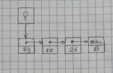

# Способы организации распределения памяти

## Способ 1: Последовательное распределение памяти
предпологает, что элементы структуры данных хранятся в смежных ячейках памяти, тоесть *n+1*-я запись непосредственно следует за *n*-ой записывают в логической последовательности так и в физическом размещении.

**Достоинства:**

1. Возможность непосредственной адресации нужной ячейки, т.к. номер ячейки легко вычислить.
2. Экономия памяти, так как элемент содержит только информацию в нём

**Недостатки:**

1. Сложность вставки и удаления элемента.
2. Необходимость заранее объявлять размер структуры данных

## Способ 2: Связанное распределение памяти.

Задаёт отношения следования и/или предшествования элементов с помощью указателей.

**Достоинства:**

1. Легко произвести вставку/удаление элемента.
2. Нет необходимости зарание резервировать память; когда вставляется новый элемент, под него выделяется любая свободная ячейка, когда элемент удаляется, ячейка освобождается

**Недостатки:**

1. Больше занимаемый объём памяти в связи с небоходимостью хранить адресса.
2. Невозможность прямого доступа к элементу.

# Динамические структуры данных

Если до начала работы с данными невозможно определить сколько памяти потребуется для их хранения, то память следует распределить во время выполнения программы, по мере необходимости отдельными блоками.

Блоки связываются между собой с помощью указателей.

Такой способ организации данных называется динамической структурой данных.

Поскольку она размещается в динамической памяти и её размер изменяется во время выполнения программы.

Динамические структуры данных в процессе существования в памяти могут иметь не только число составляющих элементов но и характер связи между элементами. При этом не учитывается изменение содержимого самих элементов данных. Такая особенность динамических структур как непостоянство их размера и характера отношений между элементами приводит к тому, что на этапе создания машинного кода нельзя выдать для всей структуры в целом участок памяти фиксированного размера. А такие структуры нельзя сопоставить с отдельными компонентами структуры конкретные адресса.

Компилятор выделяет фиксированный объём памяти для хранения адресса динамически размещаемого объекта, а не самого объекта. 

## Свойства динамической структуры данных
1. не имеет имени
2. Ей выделяется память в процессе выполнения программы
3. Количество элементов структуры может быть неизвестно заранее
4. Размерность структуры может меняться в процессе выполнения программы.
5. В процессе выполнения программы может меняться характер взаимосвязи между элементами структуры.

## Достоинства динамических структур
- Возможность обеспечения значительной изменчивости структур.
- Размер структуры ограничевается только доступным объёмом машинной памяти.
- При изменении логической последовательности элементов структуры требуется не перемещение данных в памяти, а только коррекция указателей.
- Большая гибкость

## Недостатки
- На поля, содержащие указатели для связывания элементов друг с другом, расходуется дополнительная память.
- Доступ к элементам динамической структуры может быть менее эффективным по времени.

## Порядок работы с динамическими структурами данных

- Создать/Выделить место в динамической памяти
- Работать при помощи указателя
- Удалить/Освободить занятое структурой место.

# Классификация динамических структур данных

- Однонаправленные / Односвязные списки
- Двунаправленные / Двусвязные списки
- Стек
- Дека
- Очередь
- Бинарные деревья

## Объявление динамических структур данных

Элемент данный структуры состоит из двух полей: **информационной**, в котором содержаться те данные, ради которых и создаётся структура. В общем случае информационное поле само является интегрированной структурой (Массивом, вектором, другой динамической структурой)

И **адресного**, в котором содержаться 1 или несколько указателей, связывающих данный элемент с другими элементами структуры. 

Объявление элемента динамической структуры выглядит следующим образом:

```c++
struct TypeName {
    data_field;
    adress_field;
}

// Example
struct TNode {
    int data;
    TNode *Next;
}
```

Информационных и адресных полей может быть как одно, так и несколько.

Рассмотрим в качестве примера на рисунке:



Здесь P является указателем, который указывает на первый элемент структуры, а поле next последнего элемента равного NULL, что является признаком завершённой структуры.

## Доступ к данным в динамических структурах

Для обращения к динамической структуре достаточно хранить в памяти адрес первого элемента структуры. Поскольку каждый элемент динамической структуры хранит адрес следуещего за ним элемента, можно, двигаять от начального элемента по адресам, получить доступ к любому элементу структуры.

Доступ к данным осуществляется с помощью операции ```->``` которую называют **операцией косвенного выборва элемента структурного объекта, адресуемого указателем**
(Вообще это тоже самое, что (*obj).elem). Она обеспечивает доступ к элементу структуры из адресующей её указатель того же структурного типа.

Формат применения операции следующий:

```ptr->element```

Операция "Стрелка" двумесная. Применима для доступа к элементу задаваемого правым операндом той структуры, структуру которую задаёт левый операнд. В качестве левого указатель на структуру, а в качестве парвого имя этой структуры.

## Например:

```c++
//levo  //pravo
TNode *p
p->data;
p->next;
```

## Работа с памятью при использовании динамических структур

В программах, в которых необходимо использовать динамические структуры данных, работа с памятью происходит стандартным образом. Выделение динамической памяти производится с помощью операции **new**, а освобождение с помощью **delete**

## Например:

```c++
struct Node {
    char *name;
    int val;
    Node* next;
}

Node *Pnode; // Объявление указателя
Pnode = new Node; // Выделение памяти
PNode->name = "sto" // Присвоение значений
PNode->val = 28;
PNode->next = NULL;

delete PNode; // Освобождение памяти.
```

#  Списки

Списком называется упорядоченное множество состоящее из переменного числа элементов, к которым можно применить в котором применимы операции включения\исключения

- Список отражающий отношения соседства между элементами называется линейным.

- Длинна списка равна числу элементов содержащихся в списке

- Список нулевой длинны называется пустым списком.

Для связывания элементов в списке используют систему указателей. 

В минимальном случае любой элемент линейного списка имеет один указатель или является указателем null, что интерпретируется как конец списка.

Структура элементами которого являются записи одним и тем же форматом связанныe друго-с-другом с помощью указателей хранящихся в самих элементах называется связаным списком.

В связном списке элементы линейно упорядоченны, но порядок определяется не номерами, как в массиве, а указателями.

Каждый список имеет особый элемент называемый указателем начала списка(головой списка), который обычно по содержанию отличен от остальных элементов. 

В поле указателя последнего элемента списка находятся специальный признак (null) свидетельствующий о конце списка.

## Однонаправленные списки
**Однонаправленный список** - это структура данных, представляющая собой последовательность элементов, в каждом из которых, хранится
- значение
- указатель на следующий элемент


```
ptr_on_first -> ptr -> ptr -> NULL
------------    ---    ---
content         ctn     ctn
```

Описание простейшего элемента такого списка выглядит так:

```c++
struct type_name {
    contnt_field;
    ptr_field;
};
```

Где content_field - это поле любого стандартного или ранее объявленного типа.

И ptr_field - это указатель на объект того же типа, что и определяемая структура.

### Например

```cpp
struct Node {
    int key;
    Node* next;
};

struct Point {
    char* name;
    int age;
    Point* next;
};
```

Основные операции, осуществляемые с однонаправленными списками.

- Создание списка
- Просмотр списка
- Вставка элементов в список
- Удаление элемента из списка
- Поиск элемента
- Проверка пустоты списка
- Удаление списка

Для описания алгоритмов этих основных операций будем использовать следующее объявление:

```cpp
struct List{
    int content;
    List* next;
};
```

При работе с однонаправленным списком необходимо обеспечить позиционирование какого-либо Указателя на первый Элемент. В противном случае часть ил весь список будет недоступен.

## Создание однонаправленного списка.

```cpp
List *head = NULL;
int x;
cout << "Введите элементы (пирзнак завершения 0)" << endl;

cin >> x;

if(x != 0) {
    head = new List;
    head->content = x;
    head->next = NULL;
    cin >> x;
    List *p = head;

    while(x != 0) {
        List *r = new List;
        r->content =  x;
        r->next = NULL;
        p->next = r;
        p = r;
        cin >> x;
    }
}
```


## Просмотор списка
```cpp
List* p;

while(p != NULL) {
    manipulate(p->content);
    p = p->next;
}
```

## Вставка элементов списка
---
В динамические структуры данных легко добавлять новые элементы, так как, для этого достаточно значения адрессных полей. Вставка первых и последующих элементов списка отличаются друг-от-друга

```cpp
/*Включение элемента в список после элемента со ссылкой p*/

List *r = new List;
r->content = data;
r->next = p->next;
p->next = r;
p = r;
```

## Удаление элемента.
---


```cpp
if(p->next != NULL) {
    List *r = p->next;

    p->next = r->next; 
    delete r;
}

```


```cpp
p=head;
while(p!=NULL) {
    List *r = p;
    p = p->next;
    delete r;
}
```
Рекурсивный метод

```cpp
void Delete_List(List* head) {
    if (head != NULL) {
        Delete_List(head->next);
        delete head;
    }
}
```

## Примеры
---

Найти сумму четных элементов чисел расположенных после нечётных.

```cpp
p = head;
while(p->next != NULL) {
    if(p->info % 2 != 0 && p->next->info % 2 == 0)
        sum += p->next->info;
    p = p->next;

}

cout << "SUM: " << sum << endl;
```

2. Дан однонаправленный список целых чисел. Вставить поcле каждого нечётного элемента заданное число x:

```cpp
int x;
cin >> x;

p = head;

while(p!=NULL) {
    if(p->info % 2 != 0) {
        List* r = new List;
        r->info = x;
        r->next=p->next;
        p->next = r;
        p = r;
    }
    p = p->next;
}
```

3. Дан однонаправленный список целых чисел. Если список не знакочередующийся, то удалить все нечётные элементы списка.


# Двухнаправленый список список.


## Удаление
```cc
if(p!=NULL && p->info == cond) {
    tmp = p;
    p = p->prev;
    if(p!=NULL) p->next = NULL;
    
    delete tmp;
}
```

## Вставка
```cc
p = head;
while(p != NULL) {
    if(p->info == cond) {
        DoubleList* r = new DoubleList;
        r->info = /*insert*/;
        r->next = p->next;
        r->prev = p;
        p->next = r;
        if(r->next != NULL) r->next->prev = r;

        p = r;
    }
    p = p->next;
}
```

## Проверка пустоты
```cc
bool EmptyDList(DoubleList* head) {
    if(head != NULL) return false;
    return true;
}
```

## Освобождение памяти
```cc
void DeleteDList(DoubleList* head) {
    if(haed != NULL) {
        DeleteDList(head->next);
        delete head;
    }
}
```

## Поиск элемента в двунаправленном списке.
Поиск элементов в двунаправленном может осуществляться несколькими способами.

1. Просматривая элементы от начала к концу списка
2. Просматривая элементы от конца к началу списка
3. Просматривая элементы в обоих направлениях одновременно
   
### Пример.
$X_1*X_n+X_2*X_{n-1}+...$


### Решение
```cc
struct DoubleList {
    int info;
    DoubleList* next, *prev;
};

DoubleList* head = null, *p, *r;

int x, n;
cin >> n;
cin >> x;
head = new DoubleList;
head->info = x;
head->next = NULL;
head->prev = NULL;

p=head;
for(int i = 2; i<=n; i++) {
    cin >> x;
    r = new DoubleList;
    r->info = x;
    r->next = NULL;
    r->prev = p;
    p->next = r;
    p = r;
}

int sum = 0;
while(p != NULL) {
    sum += p->info * r->info;
    cout << p->info*r->info << "\t";
    p = p->next;
    r = r->prev;
}
cout << sum;
```

# Рекурсия в списках

## Сумма кратных пяти списка рекурсивно
```cc
int sum(List *p) {
    if(p==NULL) return 0;
    if(p->info % 5 == 0) return sum(p->next) + p->info;
    return sum(p->next);
}
```

## Увелиить кратные трём элементы списка
```cc
void mutate(List*& p) {
    if(p != NULL) {
        if(p->info % 3 == 0) p->info *= 2;
        mutate(p->next);
    }
}
```

## Каждому чётному элементу присвоить -5
```cc
void InsertElement(int data, List*& p) {
    List* r = new List;
    r->info = data;
    r->next = p->next;
    p->next = r;
    p = r;                                                                                              
}
```

В первом случае - *p это указатель на тип данных List.
Во втором случае - *&p это ссылка на указатель на List.

А значит, поменяв содержимое указателя фактически меняется содержимое указателя в вызовшем эту функцию в коде.


# Двунаправленные кольцевые списки


Расмотренных видов связных списков - является **кольцевой список**, который может быть организован на основе как однонаправленного, так и двунаправленного списка.

В однонаправленном списке указатель последнего элемента должен указывать на первый элемент этого же списка.

**Графически однонаправленный кольцевой** список можно представить следующим образом: 

```
->next->next->
  info  info
```

В **двунаправленном списке** в первом и последнем эл-те соответствующий указатели переопределяются

**Графически двунаправленный  кольцевой** список можно представить след. обрпзом

Тут должна быть картинка...

Базовая статическая структура описывающая эл-т кольцевого списка аналогично структуре рассмотренной ранее при описании однонаправленного или двунаправленного списка.

Однако просмотр кольцевого списка способом описанным ранее в ввиду отсутствия указателей со значением NULL влечёт за собой попадание в бесконечный цикл.

Формально в кольцевом списке **нет понятия головы**, но рекомендуется выделять некоторый эл-т и прининмать его за голову списка.

## Построение двунаправленного кольцевого списка
```cc
DoubleList* construct() {
    int x;
    cin >> x;
    if(x != 0 ) {
        head = new DoubleList;
        head->info = x;
        head->next = head;
        head->prev = head;

        cin >> x;
        DoubleList* p = head;
        while(x != 0) {
            DoubleList* r = new DoubleList;
            r->info = x;
            r->next = head; // <<
            r->prev  = p;
            p->next = r;
            p = r;
            cin >> x;
        }

        head->prev = p;
        // p->next = head; но нужно удалить место, где помечено <<
        return head;
    }
}
```

## Обработка кольцевого списка
```cc
void mut() {
    DoubleList *p = head;
    while(p->next != head) {
        // Обработка p->info;
        p = p->next;
    }
    // Обработка последнего элемента, т.к. он не 
    //обрабатывается из-за условия в while
}
```

```cc
void mut() {
    DoubleList *p = head;
    do {
        // Обработка p->info;
        p = p->next;
    } while(p->next != head);
}
```

# Стек
В списках доступ к элементам происходит по средствам адресации, при этом, доступ к отдельным элементам неограничен существуют списковые структуры данных, в которых  имеются ограничения доступа к элементам.

Одним из представителей таких структур является **Стек**

Определение: **Стек** - это структура данных, в которой новый элемент всегда записывается в её начало(верхушку). И очередной читаемый элемент также всегда выбирается из её начала.

В стеках используется метод доступа к элементам *Lifo* - Последний пришёл первый ушёл.

При выборе элемента из стека он удаляется, а находящиеся под ним становятся новой верхушкой стека.

На стеках определены следующие операции.
- Создать стек
- Добавить элемент
- Извлечь элемент
- Проверка на пустоту
  
Стек как абстрактное хранилище данных имеет бесконечный объём, однако на практике имеющиеся в распоряжении программы объём памяти всегда конечен. И следовательно можно использовать только стек ограниченного объёма. Так называемый **Ограниченный стек**.

Очевидно, что для любого стека операции извлечь из стека определена только тогда, когда стек не пуст, а операция добавить в стек является частичной для ограниченного стека.

Ситуация, в которой делается попытка добавить в ограниченный стек элемент, а имеющаяся память уже исчерпана называется операцией **переполнения** .

# Реализация стека фиксированного размера на основе одномерного массива.

```c
#define STACK_MAX_SIZE 1000

typedef int T;

struct Stack_t {
    T data[STACK_MAX_SIZE];
    size_t size;
};
```

```c
bool empty(Stack_t* stack) {
    return (stack->size == 0);
}

bool full(Stack_t* stack) {
    return (stack->size >= STACK_MAX_SIZE);
}

void push(Stack_t* stack, const T value) {
    stack->data[stack->size] = value;
    ++stack->size;
}

T pop(Stack_t* stack) {
    --stack->size;
    return stack->data[stack->size];
}
```

```c++
int main() {
    Stack_t stack;
    stack.size = 0;

    for(int i = 0; i < 30; i++) {
        if(!full(&stack)) push(&stack, i);
        else {
            cout << "Stack overflow" << endl;
            break;
        }
    }

    if(!empty(&stack)) {
        cout << pop(&stack);
        cout << pop(&stack);
        cout << pop(&stack);
    }

    return 0;
}
```

# Реализация стека на основе однонаправленного списка.
```c++
struct Stack {
    int info;
    Stack *next;
};

Stack* CreateStack() {
    return NULL;
}

bool IsEmptyStack(Stack * top) {
    return top == NULL;
}

void Stack(int data, Stack *&top) {
    Stack *r = new Stack;
    r->info = data;
    r->next = top;
    top = r;
}
```

```c++
int pop(Stack *&top) {
    if(!IsEmptyStack(top)) {
        Stack *r = top;
        int x = r->info;
        top = top->next;
        delete r;
        return x;
    }
    return NAN;
}
```

```c++
void PrintStack(Stack *&top) {
    while(!IsEmptyStack(top))
        cout << StackPop(top) << '\t';
}
```

```c++
void DeleteStack(Stack *&top) {
    while(!IsEmptyStack(top))
         StackPop(top);
}
```

```c++
int main() {
    Stack *stack;
    stack = createStack();

    for(int i = 0; i < 30; i++)
        StackPush(i, stack);

    cout << "top = " << StackPop(stack) << endl;
    cout << "all elements = ";
    PrintStack(stack);
    DeleteStack(stack);

    return 0;
}
```

Вводится последовательность )( ][ определим правильную последовательность по след. правилу...(IMG)

```c++
int main() {
    Stack *top = CreateStack();
    bool flag = true;
    for(char x = getchar(); x!='\n'; x=getchar()) {
            switch(x) {
                case '(':
                case '[': {StackPush(x, top); break;}
                case ')': {flag = flag && (StackPop(top) == '('); break;}
                case ']': {flag = flag && (StackPop(top) == '['; break;)}    
                default: flag = false;
            }
    }
    flag = flag && IsEmptyStack(top);
    if(flag) cout << "Yes";
    else cout << "NET";

    DeleteStack(top);

        
    return 0;
}
```

# Очередь
## def: Очередь
Это структура данных, представляющая собой последовательность элементов образованную в порядке их поступления.

Каждый новый элемент размещается в конце очереди, а элемент стоящий в начале очереди выбирается из неё первым.

В очереди используется принцип доступа к элементам **FIFO**.

В очереди доступны два элемента - начало и конец очереди.

Графически очередь можно представить так:
[img]

## Основные операции производимые с очередью:
1. Создание
2. Печать/Просмотр
3. Добавление элементов в конец
4. Извлечение элемента из начала
5. Проверка пустоты
6. Очистка очереди

## Реализация очереди фиксированного размена на основе одномерного массива

```c++
#define QUEUE_MAX_SIZE const
typedef int T;

struct Queue {
    T data[QUEUE_MAX_SIZE];
    int head = 0;
    int tail = 0;
};

void push(Queue* queue, const T value) {
    queue->data[queue->tail] = vail;
    queue->tail++;
}

T pop(Queue* queue) {
    queue->head++;
    return queue->data[queue->head - 1];
}

bool empty(Queue* queue) {
    return queue->head == queue->tail;
}

bool full(Queue* queue) {
    return queue->tail >= QUEUE_MAX_SIZE;
}
```

**Alberto Balsalm - Aphex Twin.**

```c++
int main() {
    Quque queue;
    for(int i = 0; i<30; i++)
        if(!full(&queue))
            push(&queue, i);
        else {
            cout << "queue is full" << endl;
            break;
        }    
    cout << pop(&queue);
    cout << pop(&queue);

    if(!empty(&queue)) cout << pop(&queue);

    return 0;
}
```

## Todo: Реализовать с помощью динамики.


## Реализация на основе списка.

```cpp
struct Node {
  Node *next = NULL;
  int data;
};

struct Queue {
  Node *head;
  Node *tail;
};

Queue *create() {
  Node *head = new Node;
  int x;
  cin >> x;
  head->data = x;

  Node *ptr = head, *r;
  cin >> x;
  while (x) {
    r = new Node;
    r->data = x;

    ptr->next = r;
    ptr = ptr->next;
    cin >> x;
  }

  return new Queue{.head = head, .tail = ptr};
}

void push(Queue *queue, int data) {
  Node *r = new Node;
  r->data = data;
  queue->tail->next = r;
  queue->tail = r;
}

int remove_first(Queue *q) {
  int data;
  Node* tmp = q->head;
  data = tmp->data;
  q->head = q->head->next;
  delete tmp;
  return data;
}

void print(Node *ptr) {
  while (ptr != NULL) {
    cout << ptr->data << " ";
    ptr = ptr->next;
  }
  cout << endl;
}

```

## Нормальная реализация на основе списка.

```cpp
#include <iostream>
using namespace std;

struct Node {
  int data;
  Node *next;

  Node(int data) {
    this->data = data;
    this->next = nullptr;
  }
};

struct Stack {
  Node *top;

  Stack() { this->top = nullptr; }

  void push(int data) {
    Node *tmp = new Node(data);
    tmp->next = top;
    top = tmp;
  }

  bool isEmpty() { return top == nullptr; }

  int pop() {
    Node *tmp;
    if (!this->isEmpty()) {
      tmp = this->top;
      int data = tmp->data;

      top = top->next;
      delete tmp;
      return data;
    } else {
      exit(1);
    }
  }

  void display() {
    Node *temp;

    // Check for stack underflow
    if (top == NULL) {
      cout << "\nStack Underflow";
      exit(1);
    } else {
      temp = top;
      while (temp != NULL) {

        // Print node data
        cout << temp->data;

        // Assign temp link to temp
        temp = temp->next;
        if (temp != NULL)
          cout << " -> ";
      }
    }
  }
};

struct Queue {
  Node *start, *end;
  Queue() {
    start = end = nullptr;
  }

  bool isEmpty() {
    return start == nullptr;
  }

  void push(int data) {
    Node *tmp = new Node(data);
    if(end == nullptr) {
      start = end = tmp;
    } else {
      end->next = tmp;
      end = end->next;
    }
  }

  
  int dequeue() {
    if(start == nullptr) return 0;
    int data;
    Node* temp = start;
    data = temp->data;
    start = start->next;
    delete temp;
    return data;
  }
};


int main() {
  Queue q;
  q.push(153);
  q.push(320);
  q.push(3);
  cout << q.dequeue() << endl;
  cout << q.dequeue() << endl;
  q.push(124);
  cout << q.dequeue() << endl;
  return 0;
}
```

# Деревья


Дерево является - одним из частных случаев графа и одной из наиболее распространённых структур данных в программировании.

Древовидная модель эффективна для представления динамических данных с целью быстрого поиска информации.

## def: Дерево
это структура данных представляющая собой совокупность элементов и отношений образующих иерархическую структуру этих элементов.

Каждый элемент дерева называется Node/Нода/Вершина/Узел вершины дерева соеденены направленными дугами, которые называют ветвями дерева.
Начальный узел дерева называют корнем дерева и ему соответствует нулевой уровень.

Листья дерева - это вершины, в которые входят одна ветвь и не выходит ни одной ветви.

Каждое дерево обладает следующими свойствами.
1. Существует узел в которой не входит ни одной дуги
2. В каждую вершину кроме корня входит одна дуга
Все вершины, в которые входят ветви исходящие из одной общей вершины, называются потомками, а сама вершина предком, уровень потомка на единицу превосходит уровень его предка. Корень дерева не имеет предка, а листья не имеет потомка.

Глубина дерева определяется кооличеством уровней на которых распологаются его вершины. Высота пустого дерева равна нулю, высота дерева из одного корня равна единице

## Поддерево
---
**def**


Часть древовидной структуры данных,* которая может быть представлена в виде отдельного дерева. 


**def:**


**Степенью вершины** называется количество дуг, которые из неё выходят.

**def: Степень дерева**


равна максимальной степени вершины, вхоядщей в дерево, при этом *листья имею степень нуль*

По величене степени деревья различают на:

1. Двоичные(Бинарные) - Степень дерева <= 2
2. Сильно-ветвящиеся - Степень дерева - произвольная.

## **Уподяроченное дерево**
**def:**


Это дерево у которого ветви исзодящие из каждой вершины упорядочены по определённому критерию.

*Деревья являются рекурсивной структурой, в которой каждый элемент является либо пустой структурой, либо элементом с которым связана конечное число поддеревьев*

> Действия с рекурсивными структурами удобнее всего описываются с помощью рекурсивных алгоритмов.

Для того, чтобы выполнить отдельную операцию над всеми вершинами дерева необходимо все его вершины посетить. Такая задача называется **обход дерева**.

## **Обход дерева**
**def:**

Упорядоченная последовательность вершин дерева в которой каждая вершина встречается только один разю

Выделим три наиболее частых использования способа обхода дерева: 
1. **Прямой**
2. **Симметричный**
3. **Обратный**

Существует большое разнообразие древовидных структур данных:

1. **Бинарные деревья**
2. **Красно-чёрные деревья**
3. **B Tree**
4. **AVL Tree**
5. **Матричные деревья**
6. **Смешанные деревья**
7. ...

# Бинарные деревья
---

**def:**

**Бинарное(двоичное) дерево** - это динамическая структура данных, представляющих собой дерево, в которой каждая вершина имеет не более двух потомков. Каждая вершина бинарного дерева является структурой, состоящей из 4-ёх видов полей.

1. Информационное поле.
2. Служебное поле.(Их может быть несколько или вообще ни одного).
3. Указатель на левое поддерево.
4. Указатель на правое поддерево.

По степени вершин бинарные деревья делятся на:
1. Строгие. (Вершины дерева имеют степень 0 или 2)
2.  Не строгие. (Вершины дерева имеют степень 0 и 1 или 2)

В общем случае на k-ом уровне бинарного дерева может быть 

Бинарное дерево - **Полное**, если оно содержит только полностью заполненные уровни. Иначе оно **Неполное**.

Дерево - **Сбалансированно**, если длинны всех путей от корня к внешним вершинам равны между собой.

Дерево - **Почти сбалансированно**, если длинны всех путей от корня к внешним вершинам отличаются не более чем на единицу.

> Дерево может выродиться в список.

## Двоичное дерево поиска
**def:**

Бинарное дерево обладающее дополнительными свойствами. Значение *левого* потомка **меньше** значения левого, а значение *правого* потомка **больше** значения предка для каждого узла дерева.

> При каждой операции вставки нового или удаления существующего узла порядок элементов в дереве сохраняется.

Для моделирования деревьев определим следующий тип(Структуру): 

```cpp
struct Tree {
    int info;
    Tree *left;
    Tree *right;
};
```

Опишем функцию, в которой уже к имеющимуся дереву двоичного поиска добавляют новый узел так, чтобы  вновь образованное дерево также являлось двоичным деревом поиска.

### Функция добавления

```cpp
void addNode(Tree *root, int data) {
    if(data < root->info) {
        if(root->left == NULL) {
            Tree *r;
            r = new Tree;
            r->info = data;
            r->left = NULL;
            r->right = NULL;

            root->left = r;
        } else addNode(root->left, data);
    } else {
        if(root->right=NULL) {
            Tree *r;
            r = new Tree;
            r->info = data;
            r->left = NULL;
            r->right = NULL;
            root->right = r;
        } else addNode(root->right, data);
    }
}
```


### Построение дерева
```cpp
    // Построение дерева.
Tree* construct() {
    int x;
    Tree *root = new Tree;
    cin >> x;
    root->info = x;
    root->left = NULL;
    root->right = NULL;

    cin >> x;
    while(x != 0) {
        addNode(root, x);
        cin >> x;
    }

    /* for(cin>>x; x!=0; cin>>x)
    /       addNode(root,x);   
    */

    return root;
}
```

### Основные обходы деревьев
1. pre-order/NLR/Прямой/Префиксный
Вначале обрабатывается вершина, затем левое, затем правое поддерево
2. Инфиксный/LNR
3. Обратный/Кольцевой/Постфиксный/LRN/DPR

Приведём алгоритмы обхода дерева на примере вывода информационных полей.
   
### Вывод дерева NLR
```cpp
void print_nlr(Tree* root) {
    if(root != NULL) {
        cout << root->info <<" ";
        print_nlr(root->left);
        print_nlr(root->right);
    }
} 
```

### Вывод дерева симметричный LNR
```cpp
void print_lnr(Tree* root) {
    // Выведет в порядке возрастания.
    if(root != NULL) {
        print_lnr(root->left);
        cout << root->info <<" ";
        print_lnr(root->right);
    }
}  
```
### Вывод дерева обратным обходом LRN
```cpp
void print_lrn(Tree* root) {
    // Выведет в порядке возрастания.
    if(root != NULL) {
        print_lrn(root->left);
        print_lrn(root->right);
        cout << root->info <<"  ";
    }
}  
```

Согласно определению дерева все вершины храняться в динамической памяти и следовательно необходимо определить алгоритм её освобождения. Для этого удобно использовать орбатный обход дерева (LRN)

### Освобождение памяти LRN
```cpp
void Destroy(Tree* root) {
    if(root == NULL)
        return;
    Destroy(root->left);
    Destroy(root->right);
    delete root;
}
```


$\forall x, y \in L$

---
Коммичено до сюдова


## Примеры

**Пример 1**. Дано дерево двоичного поиска. Найти сумму четных элементов дерева.

```cpp
int Sum(Tree* t) {
    if(t == NULL)
        return NULL;
    else 
        if (t->info %  2 == 0)
            return t->info + Sum(t->left) +Sum(t->right);
        else return Sum(t->left) +Sum(t->right);;
}

```

**Пример 2**. Дано дерево двоичного поиска. Найти сумму элементов дерева, являющихся листьями.

```cpp
int Sum(Tree* t) {
    if(t==NULL) return 0;
    else if(t->right == NULL && t->left == NULL) 
        return t->info;
    return Sum(t->left) + Sum(t->right);
}
```

**Пример 3**. Дано дерево двоичного поиска найти максимальный элемент на заданном уровне.

```cpp
#include "algorithm"

int MaxByLevel(Tree *t, int currentLevel, int Level) {
    if(t == NULL) return -INFINITY;
    if(currentLevel == Level) return t->info;

    return max(
        MaxByLevel(t->left, currentLevel + 1, Level),
        MaxByLevel(t->right, currentLevel + 1, Level)
    );
}
```

*Второй вариант решения*
```cpp
struct Tree {
    int info;
    int level;
    Tree *left;
    Tree *right;
};
// Логично, что при построении уровень будет root->lvl + 1


int MaxByLevel(Tree *t, int level) {
    if(t==NULL) return -INFINITY;
    if(t->level == Level) return t->info;

    return max(
        MaxByLevel(t->left, level),
        MaxByLevel(t->right, level),
    );
}
```

## Удаление узла дерева
---

Существуют 3 возможных ситуации:
1. **У вершины нет потомков**. В этом случае удаляется лист,а его родитель обнуляет указатель на него.
2. **У вершины 1 потомок**. В этом случае вершина заменяется своим потомком.
3. **У вершины оба потомка**. В этом случае вершину не удаляем, а заменяем её значение на максимум левого поддерева. После этого удаляем максимум левого поддерева. Максимум левого поддерева имеет не более одного потомка, поэтому его удаление осуществить легко. Аналогично можно заменить минимумом из правого поддерева.

```cpp
Tree* DeleteNode(Tree* t, int data) {
    if (t==NULL) return t;

    if(data == t->info) {
        Tree* tmp;
        if(t->right == NULL)
            tmp = tmp->left;
        else {
            Tree* ptr = t->right;
            if(ptr->left = NULL) {
                ptr->left = t->left;
                tmp = ptr;
            } else {
                Tree *pmin = ptr->left;
                while(pmin->left != NULL) {
                    ptr = pmin;
                    pmin = ptr->left;
                }
                ptr->left = pmin->right;
                pmin->left = t->left;
                pmin->right = t->right;
                tmp = pmin;
            }
        }

        delete t;
        return tmp;
    }
    else if(data < t->info)
        t->left = DeleteNode(t->left, data);
    else
        t->right = DeleteNode(r->right, data);
    return t;
}
```

# Потоки ввода/вывода
---

Функционал потоков ввода/вывода не определён как часть языка С++, а предоставляется стандартной библиотекой С++ и находится в пространстве имён std.

**Def:**

**Поток** - последовательность символов к которым можно получить доступ. Со временем поток может производить или потреблять потенциально неограниченные объёмы данных.

Рассмотрим 2 типа вопросов.

1. Поток ввода(входной поток) используется для хранения данных полученных от источника данных(Клавиатура, файл, сеть, ...).

Например пользователь может нажать клавишу в то время, когда программа не ожидает ввода. Вместо игнорирования нажатия клавиши данные помещаются в обходной поток, где ожидают ответа от программы.

2. Поток вывода используется для хранения данных придостовляемых конкретному потребителю данных (Монитор, файл, сеть, ...)

При записи данных на устройство вывода  это устройство может быть не готово принять данные немедленно. 

Например принтер может прогреваться, когда программа уже записывает данные в выходной поток, где данные будут находиться до тех пор, пока принтер не начнёт их использовать.

Некоторые устройства такие как файлы и сети могут быть источниками как ввода, так и вывода данных.

## Ввод/ввывод в C++

Класс **istream** используется для работы с вхожными потоками.

Оператор извлечения(>>) используется для извлечения данных из потока.

Класс **ostream** используется для работы с выходными потоками.

Оператор вставки(>>) используется для помещения данных в поток.

Класс **iostream** может обрабатывать как ввод, так и вывод данных, что позволяет осуществлять двунаправленный ввод вывод.

## Стандартные потоки в С++
---

**Стандартный поток** - это предварительно подключеный поток, который предоставляется программе её окружением.

Язык C++ поставляется с четыремя предварительно определёнными стандартными объектами потоков, которые можно использовать:

* std::cin - Это класс, связанный со стандартным вводом(Обычно это клавиатура)
* std::cout - Это класс, связанный со стандартным выводом(Монитор)
* std::cerr - Это класс, связанный со стандартной ошибкой, обеспечивающий небуферизированный вывод
* std::clog - Это класс, связанный со стандартной ошибкой, обеспечивающий буферизированный вывод.

> Небуферизированный вывод обычно обрабатывается сразу же, тогда как буферизированный обычно сохраняется и выводится как блок.

Весь функционал объектов, которые работают с потоками ввода/ввывод находится в пространстве имён std - это означает, что нужно добавлять префикс std:: ко всем объектам и функциям ввода/вывода, либо использовать using namespace std;


## предотвращение переполнения
Оператор извлечения (>>) используется для считывания информации из входного потока. Одной из наиболее распростронённых проблем при считывании строк из входного потока является предотвращение переполнения.

Пример:
```cpp
char buf[12];
std::cim=n>>buf; // Если ввести > 11 то будет переполнение
```
Одним из способов решения этой проблемы является использование манипуляторов. Манипулятор - объект, который применяется для изменения потока данных, при использование оператора извлечения и оператора вставки. Например оператор **endl** одновременно выводит символ новой строки и очищает бувер. Для предотвращения переполненя можно использовать манипулятор **setw()** который ограничивает колво символов считываемых из потока. 

```cpp
char buf[12];
std::cin >> stew(12) >> buf;
```

Оператор извлечение работает только с отформатированными данными, тоесть игнорит табуляцию пробелы и новые строки ("\t" "\n" " ")

```cpp
char ch;
while (std::cin >> ch) { // вводим "hello 123";
    std::cout << ch; // Напечатает "hello123"
}
```
Если нужен текст с пробелами то для этого необходимо использовать функцию **get()** описанную в классе **iostream**.

```cpp
char ch;
while (std::cin.get(ch)) { // вводим "hello 123";
    std::cout << ch;   // Напечатает "hello 123"
}
```
Существует модификация функции **get()** с возможностью указания максимального количества символов для извлечения. 
```cpp
char strBuf[12];
std::cin.get(strBuf, 12); //Hello! My name is Johs!
std::cout << strBuf << std::endl; //Hello! My n
```
Функция **get()** не считывает символ новой строки. ВАЖНО

```cpp
cahr strBuf[12];
std::cin.get(strBuf, 12);
std::cout << strBuf << std::endl;

std::cin.get(strBuf, 12);
std::cout << strBuf << std::endl; // Не сработает, так как в потоке есть \n, по этому он попытается его считать, но не считает и пропустит

```
Решением есть **getline**, он считывает и **\n**.

# Базовый файловый ввод вывод
Файловый потоковый ввод вывод аналагичен стандартному i/o (input output) и отличается тем, что вывод осуществляется не на экран, а в файл, а считывание не с клавы, а с файла. Кроме того i/o на стандартные устройства выполняется с помощью объектов **cin/cout**, а для организации файлового i/o создаются собственные объекты. Для пработы с файлами необходимо подключить один из 3 загаловочных файлов:
* ifstream - input
* ofstream - output
* fstream - all

С помощью этих классов можно выполнить однонаправленный файловый ввод, однонаправленный файловый вывод и двунаправленный файловый ввод вывод. В отличии от потоков cin cout cerr cloc, которые можно сразу использовать, файловые потоки должны быть явно установлены программистом. Тоесть что бы открыть файл для чтения и/или записи необходимо создать объект соответствующего класса, указав имя файла в качестве параметра, затем с помощью оператора вставки или операторов извлечения можно записывать или считывать данные из файла. В конце работы с файлом обязательно закрыть файл, используя метод **close**.

## Файловый вывод

```cpp
#include <iostream>
#include <fstream>

using namespace std;

int main() {
    ofstream fout("SomeText.txt");
    if (!fout) { // Если не открылся
        cerr << "File not open!" << endl;
        return(1);
    }

    fout << "Line #1!" << endl;
    fout << "Line #2!" << endl;

    fout.close();
    return 0;
}
```

Файловый ввод (аналогично)

## Буферизированный вывод
Вывод в языке cpp может быть буферизирован, это означает, что всё что выводится в файловый поток не может сразу же быть записанным на диск. Это сделано в первую очеред по соображениям производительности, когда данные буфера записываются на диск, то происходит очистка буфера. Одним из способов очистки является закрытия файла (другим endl). В этом случае всё содержимое буфера помещается на диск и файл закрывается. Буферизация вывода обычно не является проблемаой, но пре определённых обстоятельствах может ею стать, например когда в буфере зранятся некие данные, а программа преждевременно завершает своё выполнение. В этом случае буфер не очищается, файл не закрывается и данные теряются. По этому необходимо явное закрытие всех открытых файлов.

## Режимы открытия файлов
При создании объекта файлогово потока может присутствовать второй параметр позволяющий указать способ открытия файлов в качестве этого параметра можно указать следующие флаги, которые описанны в классе ios:
* in - только чтение
* out - только запись
* app - добавление
* ate - при открытии переместить указатель в конец файла
* binary - в бинарном виде
* ftrunc - удалить содержимое файла

По умолчанию:
* ifstream - ios::in;
* ofstream - ios::out;
* fstream - ios::in | ios::out;

Существует ещё 1 способ открытия файла, с момощью **open()**, она работает аналогично функциям класса файлогого ввода вывода и принемает в качестве параметров имя файла и режим открытия файлов.

## Файловый указатель
Каждый объект файлогого ввода вывода содержит файловый указатель, используемый для отслеживания текущий позиции чтония записи данных из/в файл. Любая записть в файл. Любая запись или чтение происходит в текущем местоположении файлогого указателя. По умолчанию при открытии файла, файловый указатель находится в самом начале файла. Однако если файл открывается в режиме добавления, то файловый указатель перемещается в конец файла.

## Прямой доступ к файлам
До этого во всех примерах осуществлялся последовательный доступ к файлу. Существует возможность выполнять прямой (произвольный) доступ к файлам, он осуществляется путём манипу лирования файловым указателям с помощью функции **seekg()** или **seekp()**. Они принимают 2 параметра. Первый - смещение, на которое следует переместить файловый указатель (измеряется в байтах.) и второй, флаг из класса ios который указывает место относительно которого будет выполнятся смещение.

```cpp
ifstream &seekp(Смещение, Позиция);
ofstream &seekp(Смещение, Позиция);
```
* ios::beg начало файла
* ios::cur текущее положение
* ios::end конец файла