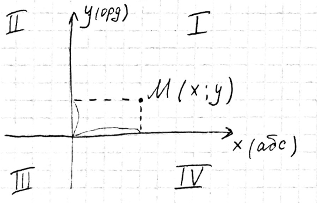
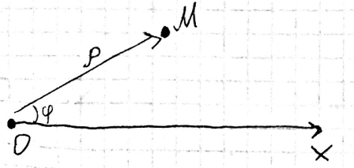
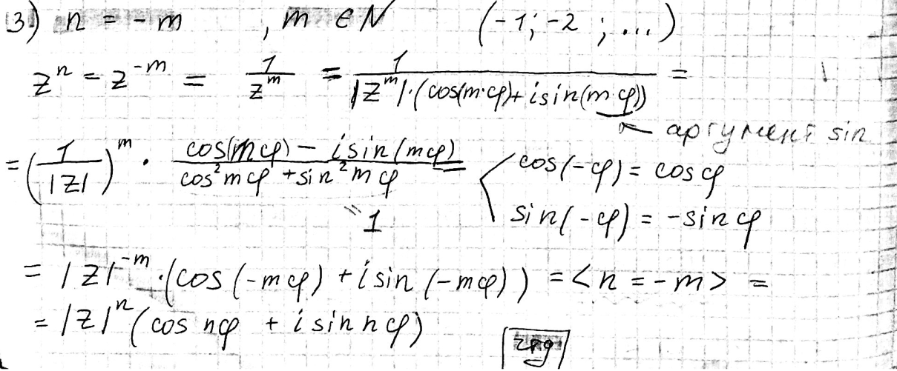

# Ответы к экзамену по курсу "Алгебра и аналитическая геометрия", 2019-2020г.

# Тема 1. Комплексные числа

## 1. Прямоугольная и полярная системы координат. Взаимосвязь координат точек в системах.

Декартова - обчная, где у точки есть х и у.

Полярная - точка имеет $\rho$ - длинну вектора (всегда положительна) и $\phi$ - аргумент (угол относительно ОХ)

Взаимосвязь между ними:

Декартова -> Полярная:
* $\rho=\sqrt{x^2+y^2}$
* $\phi=arctg\frac{y}{x}$

Полярная -> Декартова:
* $x=\rho*cos(\phi)$
* $y=\rho*sin(\phi)$

## 2. Алгебраическая форма комплексного числа. Действия над комплексными числами.

Вид числа : $x+yi$ где $x,y$ это действительные числа, а $i$ - это мнимая еденица.

 Действия:
1. Сложение $z(x, y) = (x_1 + x_2) (y_1 + y_2)$ Тоесть $z(x_1 + x_2, y_1 + y_2)$
2. Вычетание - обратное сложению.
3. Умножение $(x_1 + iy_1) (x_2 + iy_2) = x_1 x_2 − y_1y_2 + (x_1y_2 + x_2y_1)i$
4. Деление - тоже самое, что и обычное, но нужно домножить на сопряжённое

## 3. Тригонометрическая форма комплексного числа.

Записывается в виде $\rho(cos\phi * isin\phi)$ Где $\rho$ - это модуль растояния вычисляемый по формуле $\rho=|z|=\sqrt{a^2+b^2}$, а $\phi = arg(z)$ это угол (аргумент) комплекснова числа. Формула $cos\phi=\frac{a}{\sqrt{a^2+b^2}}$ и $sin\phi=\frac{b}{\sqrt{a^2+b^2}}$. Если $\rho=0$ тогда $\phi$ считается не определённым.

## 4. Возведение комплексного числа в степень с целым показателем. Формула Муавра. 

Теорема: $z^n=|z|^n(cos(n\phi)+isin(n\phi))$

Доказка:
1. Для натурального $n$ очевидна из теоремы умнажения комплексного на комлексное число.
2. При $n=0$ будет $z^0=|z|^0(cos(0*\phi)+i*sin(0*\phi))=1$
3. 

## 5. Извлечение корня из комплексного числа.
Приводим число к тригоном виду, а дальше получаем такую формулу $w_k=\sqrt[n]{z}=\sqrt[n]{\rho}(cos\frac{\phi+2\pi k}{n}+isin\frac{\phi+2\pi k}{n})$ где $k = 0...(n-1)$ Таким образом получим $n$ колво корней ибо при разных $k$ будет разный угол.

## 6 и 7 хз, помохите =)

# Тема 2. Многочлены

## Многочлен от одной переменной. Действия над многочленами. Корни многочленов. Теорема Безу. 

Многочлен (полином) от 1 переменной $x$ и $a$ из $a\in A$ называют вырожение: $ax^m$ где $m \in N$ называют степенью одночлена. Если $m=0$ то $ax^0 = a$

Подобные члены — одночлены, входящие в многочлен, которые отличаются друг от друга только коэффициентом, знаком или совсем не отличаются (противоположные одночлены тоже можно назвать подобными).

* Правило сложения одночленов: $ax^m+bx^m=x^m(a+b)$
* Правило умножения $ax^m*bx^n=a*b*x^{m+n}$

Полином $n$ степени от неизвестного $x$ называется сумма одночленов натуральных степеней не больше $n$ неизвестного $x$ взятым с неким числовым коофицентом из множества $A$. $(a_0...a_n) \in A$

$a_0x^n+a_1x^{n-1}+...+a_{n-1}x+a_n$ 

Порядок в записи не важен, но если он записан в убывающем порядке степеней $x$ то такой вид записи называется кононическим.

Действия:
* Суммой двух полиномов называется полином получающийся при объединении одночленов этих полиномов: $a_0x^n+a_1x^{n-1}+...+a_{n-1}x+a_n + b_0x^m+b_1x^{m-1}+...+b_{m-1}x+b_m$ = (Допустим что n>m) = $a_0x^n+...+a_{n-m-1}x^{m+1}+x^m(a_0+b_0)+...+x(a_{n-1}+b_{m-1})+(a_n+b_m)$.
* Произведением двух полиномов называется полином из произведения всех одночленов первого на все одночлены второго. Расписывать тут не буду, оно и так понятно. Очевидно что степень получившегося поленома равна $m+n$
* Для деления нужно немного поизвращатся, ведь любой полином можно представить в виде $f(x)=g(x)*h(x)+r(x)$ Где:
  * $f(x)$ - делимое
  * $g(x)$ - полином "делитель"
  * $h(x)$ - частное
  * $r(x)$ - остаток твоей жизни

Теорема Безу: для того, чтобы полином $f(x)$ делился на двухчлен $(x-c)$ необходимо что бы $c$ был корнем полинома $f(x)$